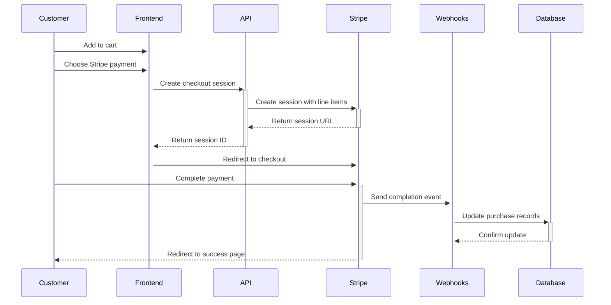

# 🔒 Stripe Payment Integration

This document outlines the complete Stripe integration for Myat Pwint Publishing House, enabling secure payment processing between book buyers and publishers.

## 📋 Overview

The integration supports:
- ✅ **Secure card payments** via Stripe Checkout
- ✅ **Myanmar Kyat (MMK)** currency support
- ✅ **Physical & Digital** book purchases
- ✅ **Automatic shipping** calculation for physical books
- ✅ **Webhook-based** order fulfillment
- ✅ **Payment status** tracking
- ✅ **Product/Price** synchronization

## 🏗️ Architecture

```
Frontend (Next.js) ↔ API Routes ↔ Stripe API
                   ↕
               Supabase DB ↔ Webhooks
```

### Key Components:
1. **Database Schema**: Extended purchases table with Stripe fields
2. **Product Sync**: Books automatically synced to Stripe as products
3. **Checkout Flow**: Stripe-hosted checkout pages
4. **Webhooks**: Real-time payment status updates
5. **Admin Tools**: Product management and sync utilities

## 🚀 Setup Instructions

### 1. Install Dependencies

```bash
npm install stripe @stripe/stripe-js
```

### 2. Configure Environment Variables

Add to your `.env.local`:

```env
# Stripe Configuration
NEXT_PUBLIC_STRIPE_PUBLISHABLE_KEY=pk_test_your_publishable_key_here
STRIPE_SECRET_KEY=sk_test_your_secret_key_here
STRIPE_WEBHOOK_SECRET=whsec_your_webhook_secret_here

# Application Configuration  
NEXT_PUBLIC_APP_URL=http://localhost:3000
```

### 3. Database Migration

The database schema has been automatically updated with:
- New columns in `purchases` table for Stripe data
- New `stripe_products` table for product mapping
- Proper indexing for performance

### 4. Stripe Dashboard Setup

1. **Create Stripe Account** at https://dashboard.stripe.com
2. **Add Webhook Endpoint**: `https://your-domain.com/api/stripe/webhooks`
3. **Configure Events**:
   - `checkout.session.completed`
   - `checkout.session.async_payment_succeeded`
   - `checkout.session.async_payment_failed`
4. **Enable Myanmar (MMK)** in your account settings

### 5. Sync Products to Stripe

Run the product sync (admin/publisher only):

```bash
POST /api/stripe/sync-products
```

Or use the publisher dashboard to sync all books to Stripe.

## 💳 Payment Flow

### For Customers:

1. **Add to Cart** → Books with delivery options
2. **Checkout** → Choose Stripe payment (recommended)
3. **Stripe Checkout** → Secure payment form
4. **Payment Processing** → Real-time status updates
5. **Confirmation** → Success page with receipt
6. **Fulfillment** → Automatic order processing

### Technical Flow:



## 📊 Database Schema

### Enhanced `purchases` Table:

```sql
purchases (
  id                      UUID PRIMARY KEY,
  user_id                 UUID REFERENCES auth.users(id),
  book_id                 UUID REFERENCES books(id),
  purchase_price          NUMERIC NOT NULL,
  purchase_type           TEXT DEFAULT 'purchase',
  payment_method          TEXT NOT NULL,
  payment_status          TEXT DEFAULT 'pending',
  transaction_id          TEXT,
  stripe_payment_intent_id TEXT,
  stripe_charge_id        TEXT,
  stripe_customer_id      TEXT,
  rental_expires_at       TIMESTAMPTZ,
  purchased_at            TIMESTAMPTZ DEFAULT NOW()
);
```

### New `stripe_products` Table:

```sql
stripe_products (
  id                  UUID PRIMARY KEY DEFAULT gen_random_uuid(),
  book_id            UUID REFERENCES books(id) ON DELETE CASCADE,
  stripe_product_id  TEXT NOT NULL UNIQUE,
  stripe_price_id    TEXT NOT NULL,
  currency           TEXT NOT NULL DEFAULT 'mmk',
  unit_amount        INTEGER NOT NULL,
  created_at         TIMESTAMPTZ DEFAULT NOW(),
  updated_at         TIMESTAMPTZ DEFAULT NOW()
);
```

## 🔄 API Endpoints

### `/api/stripe/create-checkout-session`
**POST** - Create a new Stripe checkout session
```json
{
  "items": [
    {
      "bookId": "uuid",
      "quantity": 1,
      "deliveryType": "physical"
    }
  ]
}
```

### `/api/stripe/webhooks`
**POST** - Handle Stripe webhook events
- Processes payment completions
- Updates order status
- Handles payment failures

### `/api/stripe/sync-products`
**POST** - Sync all books to Stripe (Admin only)

## 🎛️ Configuration

### Currency Setup:
- **Primary Currency**: Myanmar Kyat (MMK)
- **Smallest Unit**: Pya (1 MMK = 100 Pya)
- **Conversion**: Handled automatically in `mmkToPya()`

### Shipping:
- **Physical Books**: 5,000 MMK flat rate
- **Digital Books**: No shipping
- **Auto-detection**: Based on delivery type

### Tax:
- **Tax Codes**: Configured for digital goods
- **Stripe Tax**: Can be enabled for automatic calculation
- **Myanmar VAT**: Currently disabled (configurable)

## 🔧 Development & Testing

### Test Cards:
```
Success: 4242424242424242
3D Secure: 4000002500003155  
Declined: 4000000000009995
```

### Local Testing:
```bash
# Install Stripe CLI
stripe listen --forward-to localhost:3000/api/stripe/webhooks

# Trigger test events
stripe trigger checkout.session.completed
```

### Debug Mode:
- Check Stripe Dashboard → Events
- Monitor webhook responses
- Review application logs

## 🔐 Security

### Webhook Security:
- ✅ Signature verification
- ✅ Endpoint secret validation  
- ✅ Event type filtering

### Data Protection:
- ✅ No sensitive card data stored
- ✅ Stripe handles PCI compliance
- ✅ Customer IDs encrypted at rest

### Access Control:
- ✅ User authentication required
- ✅ Admin-only product management
- ✅ Purchase history isolation

## 📈 Monitoring & Analytics

### Payment Tracking:
```typescript
// Get payment statistics
const stats = await getPaymentStats();
console.log(stats.totalRevenue); // Total MMK earned
console.log(stats.successfulPayments); // Completed orders
```

### User Purchase History:
```typescript
// Get user's purchase history  
const history = await getUserPaymentHistory(userId);
```

## 🚨 Error Handling

### Payment Failures:
- Failed payments logged to database
- Customer notified via UI
- Automatic retry mechanisms available

### Webhook Failures:
- Stripe automatic retries (up to 3 days)
- Manual retry via dashboard
- Monitoring alerts configured

### Common Issues:
1. **Currency mismatch**: Ensure MMK enabled in Stripe
2. **Webhook timeout**: Check server response time
3. **Product sync fails**: Verify API keys and permissions

## 🔄 Migration from Fake Payments

The system maintains backward compatibility:
- ✅ Existing fake payments preserved
- ✅ New payments use Stripe
- ✅ Dual payment options during transition
- ✅ Gradual rollout support

## 📱 PWA Considerations

### Offline Payments:
- Payment status cached locally
- Sync when connection restored  
- Background sync for failed webhooks

### Mobile Optimization:
- Touch-friendly checkout
- Apple Pay / Google Pay support
- Responsive payment forms

## 🎯 Future Enhancements

### Planned Features:
- [ ] **Subscription payments** for premium content
- [ ] **Multi-vendor payouts** to publishers
- [ ] **Refund management** interface
- [ ] **Payment analytics** dashboard
- [ ] **Currency conversion** support
- [ ] **Mobile payments** (QR codes, etc.)

## 📞 Support

### For Developers:
- Review Stripe documentation: https://stripe.com/docs
- Check webhook events in Stripe Dashboard
- Monitor application logs for errors

### For Users:
- Payment issues: Contact support with session ID
- Refunds: Processed through Stripe Dashboard
- Receipt emails: Configured in Stripe settings

---

## ✅ Implementation Checklist

- [x] Database schema updated
- [x] Stripe SDK integrated
- [x] API routes created
- [x] Webhook handlers implemented
- [x] Product sync functionality
- [x] Checkout UI updated
- [x] Payment status tracking
- [x] Error handling
- [x] Security measures
- [x] Documentation complete

**Status**: ✅ **Ready for Production** (after environment setup)

**Next Steps**: Configure Stripe account and deploy webhook endpoints.