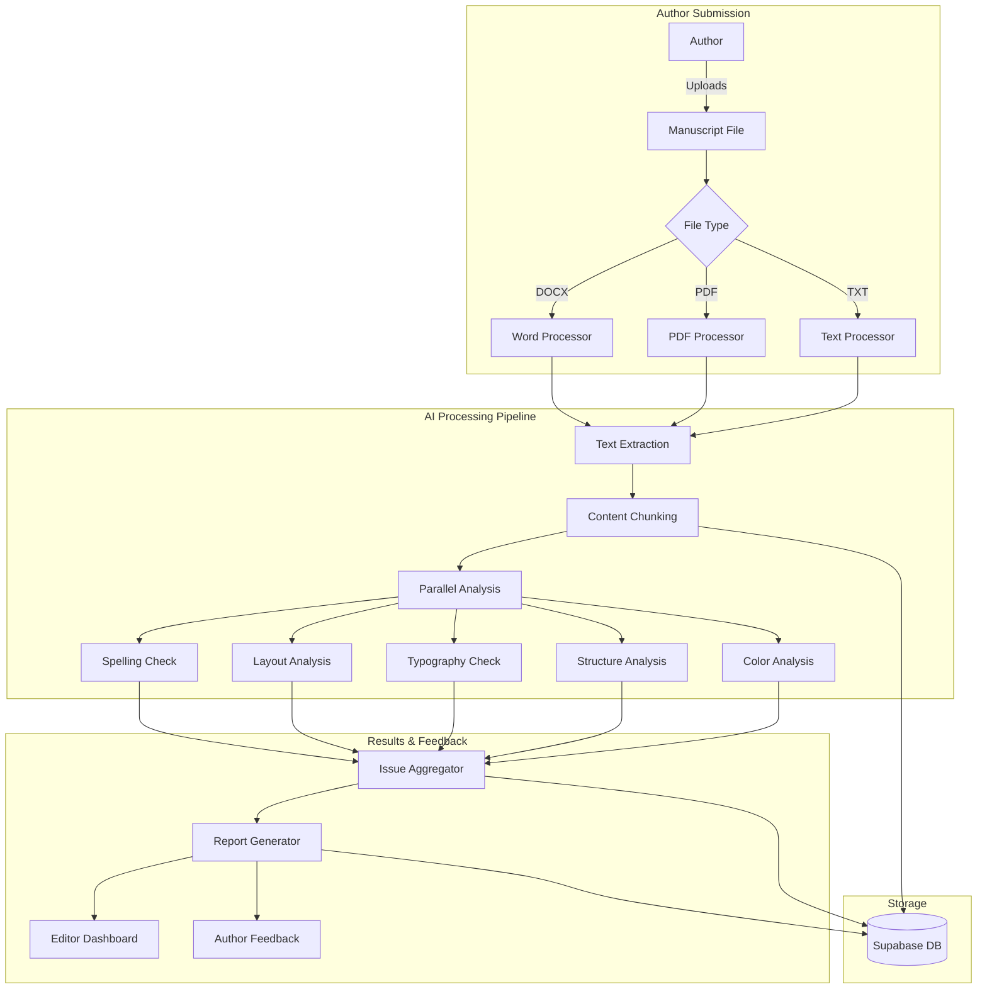

# AI Manuscript Checker Implementation Plan
## Myat Pwint Publishing House - Automated Editorial System

> **Purpose**: This document outlines the complete implementation plan for an AI-powered manuscript checking system specifically designed for Burmese/Myanmar literature. This system will automate the initial editorial review process, checking spelling, layout, structure, typography, and design elements.

> **For**: Claude Code and future development sessions - This plan serves as the authoritative guide for implementing and extending the manuscript checker feature.

---

## 📋 Table of Contents
1. [Executive Summary](#executive-summary)
2. [System Architecture](#system-architecture)
3. [Technical Stack](#technical-stack)
4. [Implementation Phases](#implementation-phases)
5. [Workflow Design](#workflow-design)
6. [Database Schema](#database-schema)
7. [API Integrations](#api-integrations)
8. [Core Components](#core-components)
9. [Myanmar Language Specifics](#myanmar-language-specifics)
10. [Testing Strategy](#testing-strategy)
11. [Performance Considerations](#performance-considerations)
12. [Future Enhancements](#future-enhancements)

---

## Executive Summary

### Problem Statement
Burmese publishers face challenges with manual manuscript review:
- Time-consuming spelling checks for Myanmar text
- Inconsistent formatting and layout
- Font compatibility issues (Zawgyi vs Unicode)
- Manual page numbering verification
- Typography standards compliance

### Solution
An AI-powered automated checker that:
- Processes Word docs, PDFs, and other formats
- Checks Myanmar spelling and grammar
- Analyzes document structure and layout
- Validates typography and font usage
- Suggests color schemes for book design
- Generates comprehensive editorial reports

### Key Benefits
- ⚡ 80% reduction in initial review time
- 🎯 Consistent quality standards
- 🌏 Myanmar language-specific validation
- 💰 100% free tier implementation
- 🔄 Seamless integration with existing workflow

---

## System Architecture



### Component Architecture

```typescript
// Core System Components
interface ManuscriptCheckerSystem {
  // Input Layer
  fileProcessors: {
    docx: DocxProcessor;
    pdf: PDFProcessor;
    txt: TextProcessor;
    image: ImageProcessor;
  };
  
  // Analysis Layer
  analyzers: {
    spelling: MyanmarSpellChecker;
    layout: LayoutAnalyzer;
    typography: TypographyChecker;
    structure: StructureAnalyzer;
    color: ColorAnalyzer;
  };
  
  // Processing Layer
  pipeline: {
    chunker: DocumentChunker;
    queue: AnalysisQueue;
    aggregator: ResultAggregator;
  };
  
  // Output Layer
  reporting: {
    generator: ReportGenerator;
    formatter: ReportFormatter;
    notifier: NotificationService;
  };
}
```

---

## Technical Stack

### Core Technologies (Already in Project)
- **Next.js 15** - API routes for processing
- **Supabase** - Storage and queue management
- **TypeScript** - Type-safe implementation
- **pgvector** - Store document embeddings

### New Integrations (All Free)

#### 1. Document Processing
```typescript
// Free Libraries
{
  "mammoth": "^1.6.0",        // DOCX to HTML conversion
  "pdf-parse": "^1.1.1",       // PDF text extraction
  "tesseract.js": "^5.0.0",    // OCR for images/scanned docs
  "sharp": "^0.33.0"           // Image processing
}
```

#### 2. Myanmar Language Processing
```typescript
// Open Source Myanmar Tools
{
  "myanmar-tools": "^1.2.0",    // Google's Myanmar text utilities
  "rabbit-node": "^1.0.0",       // Zawgyi <-> Unicode conversion
  "sylbreak": "^0.2.0"           // Myanmar syllable segmentation
}
```

#### 3. Analysis Libraries
```typescript
// Analysis Tools
{
  "natural": "^6.10.0",          // NLP processing
  "franc": "^6.1.0",             // Language detection
  "chroma-js": "^2.4.2",         // Color analysis
  "fontkit": "^2.0.2"            // Font analysis
}
```

#### 4. Free API Services
- **LanguageTool API** - 20 requests/minute (spelling/grammar)
- **Azure Computer Vision** - 5,000 transactions/month
- **Google Cloud Vision** - 1,000 units/month
- **AWS Textract** - 1,000 pages/month

---

## Implementation Phases

### Phase 1: Foundation (Week 1-2)
```typescript
// 1. Database Schema Updates
interface ManuscriptCheck {
  id: string;
  manuscript_id: string;
  status: 'pending' | 'processing' | 'completed' | 'failed';
  file_url: string;
  file_type: string;
  file_size: number;
  total_pages?: number;
  total_words?: number;
  language_detected: string[];
  created_at: Date;
  completed_at?: Date;
}

interface CheckResult {
  id: string;
  check_id: string;
  category: 'spelling' | 'layout' | 'typography' | 'structure' | 'color';
  severity: 'error' | 'warning' | 'suggestion';
  location: {
    page?: number;
    line?: number;
    paragraph?: number;
    position?: { x: number; y: number };
  };
  issue: string;
  suggestion?: string;
  metadata?: Record<string, any>;
}
```

### Phase 2: Document Processing (Week 2-3)
```typescript
// 2. File Processing Pipeline
class DocumentProcessor {
  async process(file: File): Promise<ProcessedDocument> {
    // Extract text and metadata
    const extractor = this.getExtractor(file.type);
    const rawData = await extractor.extract(file);
    
    // Chunk for processing
    const chunks = this.chunkDocument(rawData, {
      maxSize: 4000,  // tokens
      overlap: 200,
      preserveStructure: true
    });
    
    // Store in database
    await this.storeChunks(chunks);
    
    return {
      id: generateId(),
      chunks: chunks.map(c => c.id),
      metadata: rawData.metadata
    };
  }
}
```

### Phase 3: Myanmar Language Analysis (Week 3-4)
```typescript
// 3. Myanmar Spelling Checker
class MyanmarSpellChecker {
  private dictionary: Set<string>;
  private commonMistakes: Map<string, string>;
  
  async initialize() {
    // Load Myanmar dictionary
    this.dictionary = await this.loadDictionary();
    
    // Load common Zawgyi-Unicode confusions
    this.commonMistakes = await this.loadCommonMistakes();
  }
  
  async check(text: string): Promise<SpellingIssue[]> {
    // Detect encoding (Zawgyi vs Unicode)
    const encoding = detectMyanmarEncoding(text);
    
    // Convert to Unicode if needed
    if (encoding === 'zawgyi') {
      text = convertToUnicode(text);
    }
    
    // Segment into syllables
    const syllables = segmentMyanmarText(text);
    
    // Check each word
    const issues = [];
    for (const word of syllables) {
      if (!this.dictionary.has(word)) {
        issues.push({
          word,
          suggestions: this.getSuggestions(word),
          position: word.position
        });
      }
    }
    
    return issues;
  }
}
```

### Phase 4: Layout & Structure Analysis (Week 4-5)
```typescript
// 4. Layout Analyzer
class LayoutAnalyzer {
  async analyze(document: ProcessedDocument): Promise<LayoutIssue[]> {
    const issues = [];
    
    // Check page numbering
    const pageNumbers = await this.extractPageNumbers(document);
    issues.push(...this.validatePageSequence(pageNumbers));
    
    // Check headers and titles
    const headers = await this.extractHeaders(document);
    issues.push(...this.validateHeaderHierarchy(headers));
    
    // Check margins and spacing
    const layout = await this.extractLayout(document);
    issues.push(...this.validateSpacing(layout));
    
    // Check chapter structure
    const chapters = await this.extractChapters(document);
    issues.push(...this.validateChapterStructure(chapters));
    
    return issues;
  }
}
```

### Phase 5: Typography & Design (Week 5-6)
```typescript
// 5. Typography Checker
class TypographyChecker {
  private myanmarFonts = [
    'Padauk', 'Myanmar3', 'Pyidaungsu', 
    'Myanmar Sans Pro', 'Noto Sans Myanmar'
  ];
  
  async check(document: ProcessedDocument): Promise<TypographyIssue[]> {
    const issues = [];
    
    // Check font compatibility
    const fonts = await this.extractFonts(document);
    for (const font of fonts) {
      if (!this.isMyanmarCompatible(font)) {
        issues.push({
          type: 'incompatible_font',
          font: font.name,
          suggestion: this.suggestAlternative(font)
        });
      }
    }
    
    // Check font sizes and consistency
    issues.push(...this.checkFontConsistency(fonts));
    
    // Check line spacing for Myanmar text
    issues.push(...this.checkLineSpacing(document));
    
    return issues;
  }
}
```

### Phase 6: Integration & UI (Week 6-7)
```typescript
// 6. UI Components for Editor Dashboard
// src/app/editor/manuscript-checker/page.tsx
export default function ManuscriptChecker() {
  const [file, setFile] = useState<File | null>(null);
  const [analysis, setAnalysis] = useState<AnalysisResult | null>(null);
  const [progress, setProgress] = useState(0);
  
  const handleAnalyze = async () => {
    const formData = new FormData();
    formData.append('manuscript', file!);
    
    // Start SSE for progress updates
    const eventSource = new EventSource('/api/ai/manuscript/check');
    eventSource.onmessage = (event) => {
      const data = JSON.parse(event.data);
      setProgress(data.progress);
      if (data.completed) {
        setAnalysis(data.result);
        eventSource.close();
      }
    };
    
    // Upload and start processing
    await fetch('/api/ai/manuscript/upload', {
      method: 'POST',
      body: formData
    });
  };
  
  return (
    <div className="manuscript-checker">
      <FileUpload onFileSelect={setFile} />
      <AnalysisProgress progress={progress} />
      <AnalysisResults results={analysis} />
      <IssuesList issues={analysis?.issues} />
      <SuggestionsPanel suggestions={analysis?.suggestions} />
    </div>
  );
}
```

---

## Workflow Design

### Author Submission Flow
```
1. Author uploads manuscript (DOCX/PDF/TXT)
2. System validates file format and size
3. Automated check initiates
4. Progress tracked in real-time
5. Report generated upon completion
6. Author receives feedback and suggestions
```

### Editorial Review Flow
```
1. Editor notified of new submission
2. AI analysis report available
3. Editor reviews AI findings
4. Manual review for context/creativity
5. Feedback sent to author
6. Track revisions and re-checks
```

### Processing Pipeline
```typescript
// API Route: /api/ai/manuscript/check
export async function POST(request: Request) {
  const { checkId } = await request.json();
  
  // Initialize SSE
  const stream = new ReadableStream({
    async start(controller) {
      const checker = new ManuscriptChecker();
      
      // Process with progress updates
      await checker.process(checkId, (progress) => {
        controller.enqueue(`data: ${JSON.stringify({ progress })}\n\n`);
      });
      
      // Send completion
      const result = await checker.getResult(checkId);
      controller.enqueue(`data: ${JSON.stringify({ 
        completed: true, 
        result 
      })}\n\n`);
      
      controller.close();
    }
  });
  
  return new Response(stream, {
    headers: {
      'Content-Type': 'text/event-stream',
      'Cache-Control': 'no-cache',
      'Connection': 'keep-alive',
    },
  });
}
```

---

## Database Schema

### New Tables Required

```sql
-- Manuscript checks tracking
CREATE TABLE manuscript_checks (
  id UUID PRIMARY KEY DEFAULT gen_random_uuid(),
  manuscript_id UUID REFERENCES manuscripts(id),
  user_id UUID REFERENCES auth.users(id),
  status VARCHAR(20) NOT NULL DEFAULT 'pending',
  file_url TEXT NOT NULL,
  file_type VARCHAR(10) NOT NULL,
  file_size INTEGER NOT NULL,
  total_pages INTEGER,
  total_words INTEGER,
  language_detected TEXT[],
  processing_started_at TIMESTAMP,
  completed_at TIMESTAMP,
  created_at TIMESTAMP DEFAULT NOW(),
  updated_at TIMESTAMP DEFAULT NOW()
);

-- Check results
CREATE TABLE check_results (
  id UUID PRIMARY KEY DEFAULT gen_random_uuid(),
  check_id UUID REFERENCES manuscript_checks(id) ON DELETE CASCADE,
  category VARCHAR(20) NOT NULL,
  severity VARCHAR(20) NOT NULL,
  page_number INTEGER,
  line_number INTEGER,
  paragraph_number INTEGER,
  position_x FLOAT,
  position_y FLOAT,
  issue TEXT NOT NULL,
  suggestion TEXT,
  metadata JSONB,
  created_at TIMESTAMP DEFAULT NOW()
);

-- Processing queue
CREATE TABLE processing_queue (
  id UUID PRIMARY KEY DEFAULT gen_random_uuid(),
  check_id UUID REFERENCES manuscript_checks(id),
  chunk_index INTEGER NOT NULL,
  chunk_content TEXT NOT NULL,
  status VARCHAR(20) NOT NULL DEFAULT 'pending',
  attempts INTEGER DEFAULT 0,
  last_error TEXT,
  processed_at TIMESTAMP,
  created_at TIMESTAMP DEFAULT NOW()
);

-- Myanmar dictionary cache
CREATE TABLE myanmar_dictionary (
  id SERIAL PRIMARY KEY,
  word VARCHAR(100) UNIQUE NOT NULL,
  frequency INTEGER DEFAULT 1,
  is_valid BOOLEAN DEFAULT true,
  alternatives TEXT[],
  created_at TIMESTAMP DEFAULT NOW()
);

-- Create indexes for performance
CREATE INDEX idx_manuscript_checks_status ON manuscript_checks(status);
CREATE INDEX idx_check_results_check_id ON check_results(check_id);
CREATE INDEX idx_check_results_category ON check_results(category);
CREATE INDEX idx_processing_queue_status ON processing_queue(status);
CREATE INDEX idx_myanmar_dictionary_word ON myanmar_dictionary(word);
```

---

## API Integrations

### 1. LanguageTool Integration (Spelling/Grammar)
```typescript
// src/lib/ai/services/languagetool.ts
class LanguageToolService {
  private baseUrl = 'https://api.languagetool.org/v2/check';
  private maxChunkSize = 20000; // characters
  
  async check(text: string, language = 'my'): Promise<GrammarIssue[]> {
    const response = await fetch(this.baseUrl, {
      method: 'POST',
      headers: {
        'Content-Type': 'application/x-www-form-urlencoded',
      },
      body: new URLSearchParams({
        text: text.substring(0, this.maxChunkSize),
        language: language,
        enabledRules: 'UPPERCASE_SENTENCE_START,WORD_REPEAT',
      }),
    });
    
    const data = await response.json();
    return this.parseResults(data.matches);
  }
}
```

### 2. Tesseract.js Integration (OCR)
```typescript
// src/lib/ai/services/ocr.ts
import Tesseract from 'tesseract.js';

class OCRService {
  async extractText(imageBuffer: ArrayBuffer): Promise<string> {
    const worker = await Tesseract.createWorker('mya+eng');
    await worker.setParameters({
      tessedit_pageseg_mode: Tesseract.PSM.AUTO,
    });
    
    const { data: { text } } = await worker.recognize(imageBuffer);
    await worker.terminate();
    
    return text;
  }
}
```

### 3. Computer Vision Integration
```typescript
// src/lib/ai/services/vision.ts
class VisionService {
  private azureEndpoint = process.env.AZURE_VISION_ENDPOINT;
  private azureKey = process.env.AZURE_VISION_KEY;
  
  async analyzeLayout(imageUrl: string): Promise<LayoutData> {
    const response = await fetch(`${this.azureEndpoint}/vision/v3.2/read/analyze`, {
      method: 'POST',
      headers: {
        'Ocp-Apim-Subscription-Key': this.azureKey!,
        'Content-Type': 'application/json',
      },
      body: JSON.stringify({ url: imageUrl }),
    });
    
    // Poll for results
    const operationLocation = response.headers.get('Operation-Location');
    return this.pollForResults(operationLocation!);
  }
}
```

---

## Core Components

### 1. Document Chunker
```typescript
// src/lib/ai/manuscript/chunker.ts
export class DocumentChunker {
  chunk(content: string, options: ChunkOptions): DocumentChunk[] {
    const chunks: DocumentChunk[] = [];
    const sentences = this.splitIntoSentences(content);
    
    let currentChunk = '';
    let currentTokens = 0;
    
    for (const sentence of sentences) {
      const tokens = this.countTokens(sentence);
      
      if (currentTokens + tokens > options.maxTokens) {
        chunks.push({
          id: generateId(),
          content: currentChunk,
          tokens: currentTokens,
          index: chunks.length,
        });
        
        // Start new chunk with overlap
        currentChunk = this.getOverlap(currentChunk, options.overlap);
        currentTokens = this.countTokens(currentChunk);
      }
      
      currentChunk += ' ' + sentence;
      currentTokens += tokens;
    }
    
    // Add final chunk
    if (currentChunk) {
      chunks.push({
        id: generateId(),
        content: currentChunk,
        tokens: currentTokens,
        index: chunks.length,
      });
    }
    
    return chunks;
  }
}
```

### 2. Myanmar Text Processor
```typescript
// src/lib/ai/myanmar/processor.ts
export class MyanmarTextProcessor {
  private zawgyiDetector = new ZawgyiDetector();
  private converter = new ZawgyiConverter();
  private syllableBreaker = new SyllableBreaker();
  
  process(text: string): ProcessedMyanmarText {
    // Detect encoding
    const probability = this.zawgyiDetector.getZawgyiProbability(text);
    const isZawgyi = probability > 0.95;
    
    // Convert if needed
    let unicodeText = text;
    if (isZawgyi) {
      unicodeText = this.converter.zawgyiToUnicode(text);
    }
    
    // Break into syllables
    const syllables = this.syllableBreaker.break(unicodeText);
    
    // Extract words
    const words = this.extractWords(syllables);
    
    return {
      original: text,
      unicode: unicodeText,
      encoding: isZawgyi ? 'zawgyi' : 'unicode',
      syllables,
      words,
      stats: {
        totalSyllables: syllables.length,
        totalWords: words.length,
        uniqueWords: new Set(words).size,
      }
    };
  }
}
```

### 3. Analysis Queue Manager
```typescript
// src/lib/ai/manuscript/queue.ts
export class AnalysisQueueManager {
  private concurrency = 3; // Process 3 chunks in parallel
  private queue: Queue;
  
  async processManuscript(checkId: string) {
    // Get all chunks
    const chunks = await this.getChunks(checkId);
    
    // Create job for each chunk
    const jobs = chunks.map(chunk => ({
      checkId,
      chunkId: chunk.id,
      type: 'analyze_chunk',
      data: chunk,
    }));
    
    // Add to queue
    await this.queue.addBulk(jobs);
    
    // Process with concurrency limit
    this.queue.process(this.concurrency, async (job) => {
      try {
        const result = await this.analyzeChunk(job.data);
        await this.saveResult(result);
        
        // Update progress
        await this.updateProgress(checkId);
        
        return result;
      } catch (error) {
        console.error('Chunk processing failed:', error);
        throw error;
      }
    });
  }
}
```

---

## Myanmar Language Specifics

### 1. Zawgyi vs Unicode Detection
```typescript
// Common patterns that indicate Zawgyi encoding
const zawgyiPatterns = [
  /[\u1031][\u103b\u103c]/,  // ေ before ျ or ြ
  /[\u1031][\u1000-\u1021]/,  // ေ before consonants
  /[\u103b][\u103a]/,         // ျ before ်
];

// Unicode validation
const unicodeRanges = {
  consonants: [0x1000, 0x1021],
  vowels: [0x1023, 0x1027],
  tones: [0x1036, 0x1037],
  medials: [0x103B, 0x103E],
};
```

### 2. Myanmar Spelling Dictionary
```typescript
// Build dictionary from sources
const dictionarySource = {
  // Government approved word list
  official: 'https://myanmar-dictionary.org/official-words.json',
  
  // Common words corpus
  common: await loadCommonWords(),
  
  // Technical terms
  technical: await loadTechnicalTerms(),
  
  // Proper nouns (places, names)
  properNouns: await loadProperNouns(),
};
```

### 3. Typography Rules
```typescript
const myanmarTypographyRules = {
  // Minimum font size for readability
  minFontSize: 12,
  
  // Line height for Myanmar text
  lineHeight: 1.8,
  
  // Recommended fonts
  recommendedFonts: [
    'Padauk',
    'Pyidaungsu',
    'Myanmar3',
    'Noto Sans Myanmar'
  ],
  
  // Character spacing
  letterSpacing: 0.05,
  
  // Paragraph spacing
  paragraphSpacing: 1.5,
};
```

---

## Testing Strategy

### 1. Unit Tests
```typescript
// __tests__/myanmar-checker.test.ts
describe('MyanmarSpellChecker', () => {
  it('should detect Zawgyi encoding', () => {
    const text = 'ေရးသားထားေသာ';  // Zawgyi
    const result = checker.detectEncoding(text);
    expect(result).toBe('zawgyi');
  });
  
  it('should convert Zawgyi to Unicode', () => {
    const zawgyi = 'ေရးသား';
    const unicode = checker.convertToUnicode(zawgyi);
    expect(unicode).toBe('ရေးသား');
  });
  
  it('should identify spelling errors', () => {
    const text = 'မြနမာ';  // Wrong: မြန်မာ
    const errors = checker.check(text);
    expect(errors).toHaveLength(1);
    expect(errors[0].suggestion).toBe('မြန်မာ');
  });
});
```

### 2. Integration Tests
```typescript
// __tests__/manuscript-processing.test.ts
describe('Manuscript Processing', () => {
  it('should process DOCX file', async () => {
    const file = await loadTestFile('sample.docx');
    const result = await processor.process(file);
    
    expect(result.chunks).toBeGreaterThan(0);
    expect(result.metadata.pageCount).toBe(10);
  });
  
  it('should handle large manuscripts', async () => {
    const file = await loadTestFile('large-book.pdf');
    const result = await processor.process(file);
    
    expect(result.status).toBe('completed');
    expect(result.processingTime).toBeLessThan(60000); // 1 minute
  });
});
```

### 3. Load Testing
```typescript
// __tests__/load-test.ts
describe('Load Testing', () => {
  it('should handle concurrent manuscript checks', async () => {
    const files = await loadMultipleTestFiles(10);
    const promises = files.map(file => processor.process(file));
    
    const results = await Promise.all(promises);
    expect(results.every(r => r.status === 'completed')).toBe(true);
  });
});
```

---

## Performance Considerations

### 1. Caching Strategy
```typescript
const cacheStrategy = {
  // Cache dictionary lookups
  dictionaryCache: new LRUCache({ max: 10000 }),
  
  // Cache OCR results for identical images
  ocrCache: new Map(),
  
  // Cache API responses
  apiCache: {
    ttl: 3600, // 1 hour
    storage: 'memory', // or 'redis'
  },
};
```

### 2. Resource Management
```typescript
const resourceLimits = {
  // Maximum file size
  maxFileSize: 50 * 1024 * 1024, // 50MB
  
  // Concurrent processing
  maxConcurrentJobs: 3,
  
  // API rate limits
  apiRateLimits: {
    languageTool: 20, // per minute
    azureVision: 20,  // per second
    googleVision: 10, // per second
  },
  
  // Memory limits
  maxMemoryUsage: 512 * 1024 * 1024, // 512MB
};
```

### 3. Optimization Techniques
```typescript
// Stream processing for large files
async function* processLargeFile(file: File) {
  const reader = file.stream().getReader();
  let buffer = '';
  
  while (true) {
    const { done, value } = await reader.read();
    if (done) break;
    
    buffer += new TextDecoder().decode(value);
    
    // Process when buffer reaches threshold
    if (buffer.length > 10000) {
      yield processChunk(buffer);
      buffer = '';
    }
  }
  
  // Process remaining
  if (buffer) {
    yield processChunk(buffer);
  }
}
```

---

## Future Enhancements

### Phase 2 Features (3-6 months)
1. **Machine Learning Models**
   - Train custom Myanmar spell checker
   - Style consistency detection
   - Genre-specific validation

2. **Advanced Analytics**
   - Readability scores for Myanmar text
   - Audience age appropriateness
   - Cultural sensitivity checking

3. **Collaboration Features**
   - Real-time collaborative editing
   - Track changes and versions
   - Editor-Author chat system

### Phase 3 Features (6-12 months)
1. **AI Writing Assistant**
   - Grammar suggestions
   - Style improvements
   - Plot consistency checking

2. **Publishing Automation**
   - Auto-formatting for print
   - E-book generation
   - Cover design suggestions

3. **Market Analysis**
   - Similar book detection
   - Market demand prediction
   - Pricing recommendations

---

## Implementation Timeline

### Week 1-2: Foundation
- [ ] Set up database schema
- [ ] Create API routes structure
- [ ] Implement file upload system
- [ ] Basic UI components

### Week 3-4: Core Processing
- [ ] Document parsing (DOCX, PDF)
- [ ] Text extraction and chunking
- [ ] Queue system setup
- [ ] Progress tracking

### Week 5-6: Myanmar Language
- [ ] Zawgyi detection/conversion
- [ ] Dictionary setup
- [ ] Spelling checker
- [ ] Typography validation

### Week 7-8: Analysis Features
- [ ] Layout analysis
- [ ] Structure checking
- [ ] Color analysis
- [ ] Report generation

### Week 9-10: Testing & Polish
- [ ] Comprehensive testing
- [ ] Performance optimization
- [ ] UI/UX improvements
- [ ] Documentation

---

## Success Metrics

### Technical Metrics
- Processing speed: < 1 minute per 100 pages
- Accuracy: > 95% for spelling detection
- Uptime: 99.9% availability
- API usage: Stay within free tiers

### Business Metrics
- Editor time saved: 80% reduction
- Author satisfaction: > 4.5/5 rating
- Manuscript quality: 50% fewer revisions
- Processing volume: 100+ manuscripts/month

---

## Notes for Implementation

### For Claude Code (Current Session)
1. Start with Phase 1 foundation
2. Use existing Supabase setup
3. Leverage current authentication system
4. Build on existing manuscript table

### For Future Sessions
1. This plan is the source of truth
2. Check implementation progress in `/src/lib/ai/manuscript/`
3. Test files located in `/__tests__/manuscript/`
4. API routes in `/src/app/api/ai/manuscript/`

### Critical Dependencies
1. Ensure Supabase has sufficient storage
2. Set up environment variables for APIs
3. Install required npm packages
4. Configure CORS for file uploads

---

## Conclusion

This AI manuscript checker will revolutionize the editorial process for Myat Pwint Publishing House by:
- Automating repetitive tasks
- Ensuring consistent quality
- Supporting Myanmar language specifics
- Reducing time-to-market for books
- Maintaining cost-effectiveness with free services

The modular architecture ensures easy maintenance and future enhancements while the comprehensive testing strategy guarantees reliability.

---

*Last Updated: [Current Date]*
*Version: 1.0.0*
*Author: Claude Code for Myat Pwint Publishing House*