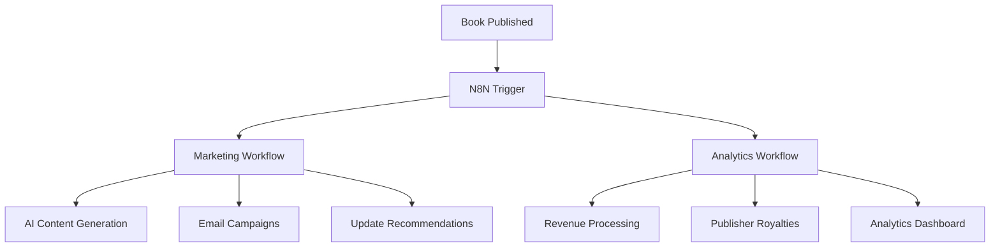

# 🚀 N8N Workflow Automation Implementation Plan

## 📋 Overview

This document outlines the implementation of N8N workflow automation for Myat Pwint Publishing House, focusing on **Marketing Automation** and **Revenue & Analytics Pipeline**. These workflows will automate the entire book publishing and marketing process using modern industry-standard tools.

## 🛠️ Tech Stack

- **N8N**: Workflow automation platform
- **Google Gemini API**: AI content generation (free tier)
- **Supabase**: Database and real-time updates
- **Stripe API**: Payment and revenue data
- **Nodemailer**: Email automation
- **Redis**: Caching and session management
- **Docker**: Containerization

## 🎯 Implementation Architecture



---

## 🎨 Marketing Automation Workflow

### **Workflow 1: AI-Powered Social Media & Email Marketing**

#### **Trigger Event**: New Book Published
```json
{
  "webhook_url": "https://your-domain.com/api/n8n/book-published",
  "event_type": "book.published",
  "book_data": {
    "id": "uuid",
    "name": "Book Title",
    "author": "Author Name",
    "description": "Book description",
    "category": "Fiction",
    "price": 15000,
    "image_url": "https://...",
    "language": "myanmar"
  }
}
```

#### **Step 1: AI Content Generation Node**
```javascript
// N8N Function Node: Generate Marketing Content
const bookData = $json.book_data;

// Gemini API prompts for different platforms
const prompts = {
  facebook: `Create an engaging Facebook post for a new ${bookData.language} book:
Title: ${bookData.name}
Author: ${bookData.author}
Description: ${bookData.description}
Category: ${bookData.category}

Make it exciting, include relevant hashtags, and write in both Myanmar and English.
Keep it under 300 characters.`,

  twitter: `Create a Twitter post for a new book launch:
"${bookData.name}" by ${bookData.author}
${bookData.description}

Include relevant hashtags and emojis. Keep under 280 characters.
Write in ${bookData.language === 'myanmar' ? 'Myanmar script with English translation' : 'English'}.`,

  email_subject: `Create an engaging email subject line for book launch: "${bookData.name}" by ${bookData.author}`,

  email_body: `Create a professional email marketing content for book launch:
Book: ${bookData.name}
Author: ${bookData.author}
Description: ${bookData.description}
Price: ${bookData.price} MMK

Include call-to-action buttons and make it compelling for Myanmar readers.
Format as HTML email template.`
};

return [
  {
    json: {
      book_id: bookData.id,
      prompts: prompts,
    }
  }
];
```

#### **Step 2: Google Gemini API Integration**
```javascript
// N8N HTTP Request Node Configuration
{
  "method": "POST",
  "url": "https://generativelanguage.googleapis.com/v1beta/models/gemini-pro:generateContent",
  "headers": {
    "Content-Type": "application/json",
    "Authorization": "Bearer {{$env.GEMINI_API_KEY}}"
  },
  "body": {
    "contents": [{
      "parts": [{
        "text": "{{$json.prompts.facebook}}"
      }]
    }],
    "generationConfig": {
      "temperature": 0.7,
      "maxOutputTokens": 500
    }
  }
}
```

#### **Step 3: Social Media Content Processing**
```javascript
// N8N Function Node: Process AI Generated Content
const responses = $input.all();
const socialContent = {};

responses.forEach((response, index) => {
  const platforms = ['facebook', 'twitter', 'email_subject', 'email_body'];
  const content = response.json.candidates[0].content.parts[0].text;
  
  socialContent[platforms[index]] = {
    content: content.trim(),
    generated_at: new Date().toISOString(),
    book_id: $("Step 1").first().json.book_id
  };
});

return [{
  json: {
    social_content: socialContent,
    book_data: $("Webhook").first().json.book_data
  }
}];
```

#### **Step 4: Email Campaign Creation**
```javascript
// N8N Email Node Configuration
{
  "to": "subscribers@myatpwint.com", // Will be replaced with subscriber list
  "subject": "{{$json.social_content.email_subject.content}}",
  "html": `
    <div style="max-width: 600px; margin: 0 auto; font-family: Arial, sans-serif;">
      <header style="background: #641B2E; color: white; padding: 20px; text-align: center;">
        <h1>📚 Myat Pwint Publishing House</h1>
      </header>
      
      <main style="padding: 20px;">
        
        
        <div>
          {{$json.social_content.email_body.content}}
        </div>
        
        <div style="clear: both; margin-top: 30px; text-align: center;">
          <a href="https://myatpwint.com/books/{{$json.book_data.id}}" 
             style="background: #641B2E; color: white; padding: 15px 30px; 
                    text-decoration: none; border-radius: 5px; display: inline-block;">
            📖 Read Now - {{$json.book_data.price}} MMK
          </a>
        </div>
      </main>
      
      <footer style="background: #f5f5f5; padding: 20px; text-align: center; color: #666;">
        <p>Myat Pwint Publishing House - Digital Books for Myanmar</p>
      </footer>
    </div>
  `,
  "attachments": []
}
```

#### **Step 5: Update Recommendation Engine**
```javascript
// N8N Supabase Node: Update Recommendations
{
  "operation": "upsert",
  "table": "book_recommendations",
  "data": {
    "book_id": "{{$json.book_data.id}}",
    "category": "{{$json.book_data.category}}",
    "author": "{{$json.book_data.author}}",
    "tags": ["new_release", "trending", "{{$json.book_data.category.toLowerCase()}}"],
    "boost_score": 1.5, // New books get priority
    "marketing_campaign_active": true,
    "campaign_start_date": "{{new Date().toISOString()}}",
    "generated_content": {
      "social_posts": "{{$json.social_content}}",
      "ai_generated": true,
      "generation_timestamp": "{{new Date().toISOString()}}"
    }
  }
}
```

#### **Step 6: Schedule Social Media Posts**
```javascript
// N8N Schedule Node: Stagger social media posts
const schedules = [
  { platform: 'facebook', delay: '0 minutes' },
  { platform: 'twitter', delay: '2 hours' },
  { platform: 'instagram', delay: '4 hours' },
  { platform: 'email', delay: '1 day' }
];

// Store content for scheduled posting
return schedules.map(schedule => ({
  json: {
    platform: schedule.platform,
    content: $json.social_content[schedule.platform],
    book_data: $json.book_data,
    scheduled_for: new Date(Date.now() + parseDelay(schedule.delay)).toISOString()
  }
}));
```

---

## 💰 Revenue & Analytics Pipeline

### **Workflow 2: Automated Revenue Processing**

#### **Trigger Event**: Stripe Webhook
```json
{
  "webhook_url": "https://your-domain.com/api/n8n/stripe-webhook",
  "event_types": [
    "checkout.session.completed",
    "payment_intent.succeeded",
    "invoice.payment_succeeded"
  ]
}
```

#### **Step 1: Payment Data Processing**
```javascript
// N8N Function Node: Process Stripe Data
const stripeEvent = $json;

function processPaymentData(event) {
  const paymentData = {
    event_type: event.type,
    payment_id: event.data.object.id,
    amount: event.data.object.amount_total || event.data.object.amount,
    currency: event.data.object.currency,
    customer_id: event.data.object.customer,
    status: event.data.object.status,
    created: new Date(event.data.object.created * 1000).toISOString(),
    metadata: event.data.object.metadata || {}
  };

  // Extract book information from metadata
  if (paymentData.metadata.book_id) {
    paymentData.book_id = paymentData.metadata.book_id;
    paymentData.user_id = paymentData.metadata.user_id;
  }

  return paymentData;
}

const processedData = processPaymentData(stripeEvent);

return [{
  json: {
    payment_data: processedData,
    processing_timestamp: new Date().toISOString()
  }
}];
```

#### **Step 2: Revenue Calculation Engine**
```javascript
// N8N Function Node: Calculate Royalties and Fees
const paymentData = $json.payment_data;

function calculateRevenue(payment) {
  const amount = payment.amount / 100; // Convert from cents
  
  // Revenue breakdown
  const platformFee = amount * 0.05; // 5% platform fee
  const stripeFee = (amount * 0.029) + 0.30; // Stripe fees
  const publisherRoyalty = amount * 0.70; // 70% to publisher
  const authorRoyalty = amount * 0.20; // 20% to author
  const netRevenue = amount - stripeFee;
  
  return {
    gross_amount: amount,
    platform_fee: platformFee,
    stripe_fee: stripeFee,
    publisher_royalty: publisherRoyalty,
    author_royalty: authorRoyalty,
    net_revenue: netRevenue,
    currency: payment.currency,
    payment_id: payment.payment_id,
    book_id: payment.book_id,
    calculated_at: new Date().toISOString()
  };
}

const revenueBreakdown = calculateRevenue(paymentData);

return [{
  json: {
    revenue_data: revenueBreakdown,
    original_payment: paymentData
  }
}];
```

#### **Step 3: Update Revenue Database**
```javascript
// N8N Supabase Node: Store Revenue Data
{
  "operation": "insert",
  "table": "revenue_analytics",
  "data": {
    "payment_id": "{{$json.revenue_data.payment_id}}",
    "book_id": "{{$json.revenue_data.book_id}}",
    "gross_amount": "{{$json.revenue_data.gross_amount}}",
    "platform_fee": "{{$json.revenue_data.platform_fee}}",
    "stripe_fee": "{{$json.revenue_data.stripe_fee}}",
    "publisher_royalty": "{{$json.revenue_data.publisher_royalty}}",
    "author_royalty": "{{$json.revenue_data.author_royalty}}",
    "net_revenue": "{{$json.revenue_data.net_revenue}}",
    "currency": "{{$json.revenue_data.currency}}",
    "processed_at": "{{$json.revenue_data.calculated_at}}",
    "status": "calculated"
  }
}
```

#### **Step 4: Publisher Royalty Processing**
```javascript
// N8N Function Node: Aggregate Publisher Earnings
const revenueData = $json.revenue_data;

// Get book and publisher information
const bookQuery = {
  "operation": "select",
  "table": "books",
  "columns": ["id", "name", "author", "publisher_id"],
  "filters": {
    "id": revenueData.book_id
  }
};

// This would be processed in the next Supabase node
return [{
  json: {
    revenue_data: revenueData,
    book_query: bookQuery
  }
}];
```

#### **Step 5: Generate Analytics Reports**
```javascript
// N8N Function Node: Create Daily Analytics Summary
const today = new Date().toISOString().split('T')[0];

function generateDailyReport(revenueData) {
  return {
    report_date: today,
    total_sales: revenueData.gross_amount,
    total_transactions: 1,
    platform_revenue: revenueData.platform_fee,
    stripe_costs: revenueData.stripe_fee,
    publisher_payouts: revenueData.publisher_royalty,
    author_payouts: revenueData.author_royalty,
    net_profit: revenueData.platform_fee - revenueData.stripe_fee,
    currency: revenueData.currency,
    generated_at: new Date().toISOString()
  };
}

const dailyReport = generateDailyReport($json.revenue_data);

return [{
  json: {
    daily_report: dailyReport,
    update_type: "increment" // For aggregation
  }
}];
```

#### **Step 6: Real-time Dashboard Updates**
```javascript
// N8N Webhook Node: Trigger Dashboard Refresh
{
  "method": "POST",
  "url": "https://your-domain.com/api/analytics/realtime-update",
  "headers": {
    "Content-Type": "application/json",
    "Authorization": "Bearer {{$env.DASHBOARD_API_KEY}}"
  },
  "body": {
    "event_type": "revenue_updated",
    "data": {
      "payment_id": "{{$json.revenue_data.payment_id}}",
      "amount": "{{$json.revenue_data.gross_amount}}",
      "book_id": "{{$json.revenue_data.book_id}}",
      "timestamp": "{{new Date().toISOString()}}",
      "dashboard_sections": [
        "total_revenue",
        "daily_sales",
        "top_books",
        "publisher_earnings"
      ]
    }
  }
}
```

---

## 🚀 Setup & Installation

### **1. N8N Installation**
```bash
# Using Docker (Recommended)
docker run -it --rm \
  --name n8n \
  -p 5678:5678 \
  -e DB_TYPE=postgresdb \
  -e DB_POSTGRESDB_HOST=your-supabase-host \
  -e DB_POSTGRESDB_DATABASE=postgres \
  -e DB_POSTGRESDB_USER=postgres \
  -e DB_POSTGRESDB_PASSWORD=your-password \
  -e N8N_BASIC_AUTH_ACTIVE=true \
  -e N8N_BASIC_AUTH_USER=admin \
  -e N8N_BASIC_AUTH_PASSWORD=your-password \
  -v ~/.n8n:/home/node/.n8n \
  docker.n8n.io/n8nio/n8n
```

### **2. Environment Variables**
```env
# .env file for N8N
GEMINI_API_KEY=your_gemini_api_key
SUPABASE_URL=your_supabase_url
SUPABASE_SERVICE_KEY=your_service_key
STRIPE_WEBHOOK_SECRET=your_stripe_webhook_secret
DASHBOARD_API_KEY=your_dashboard_api_key
EMAIL_HOST=smtp.gmail.com
EMAIL_USER=your_email@gmail.com
EMAIL_PASSWORD=your_app_password
```

### **3. Database Schema Updates**
```sql
-- Add tables for analytics and recommendations
CREATE TABLE book_recommendations (
  id UUID DEFAULT gen_random_uuid() PRIMARY KEY,
  book_id UUID REFERENCES books(id),
  category TEXT,
  author TEXT,
  tags TEXT[],
  boost_score DECIMAL DEFAULT 1.0,
  marketing_campaign_active BOOLEAN DEFAULT FALSE,
  campaign_start_date TIMESTAMPTZ,
  generated_content JSONB,
  created_at TIMESTAMPTZ DEFAULT NOW(),
  updated_at TIMESTAMPTZ DEFAULT NOW()
);

CREATE TABLE revenue_analytics (
  id UUID DEFAULT gen_random_uuid() PRIMARY KEY,
  payment_id TEXT UNIQUE,
  book_id UUID REFERENCES books(id),
  gross_amount DECIMAL,
  platform_fee DECIMAL,
  stripe_fee DECIMAL,
  publisher_royalty DECIMAL,
  author_royalty DECIMAL,
  net_revenue DECIMAL,
  currency TEXT DEFAULT 'mmk',
  processed_at TIMESTAMPTZ,
  status TEXT DEFAULT 'calculated',
  created_at TIMESTAMPTZ DEFAULT NOW()
);

CREATE TABLE daily_analytics (
  id UUID DEFAULT gen_random_uuid() PRIMARY KEY,
  report_date DATE UNIQUE,
  total_sales DECIMAL DEFAULT 0,
  total_transactions INTEGER DEFAULT 0,
  platform_revenue DECIMAL DEFAULT 0,
  stripe_costs DECIMAL DEFAULT 0,
  publisher_payouts DECIMAL DEFAULT 0,
  author_payouts DECIMAL DEFAULT 0,
  net_profit DECIMAL DEFAULT 0,
  currency TEXT DEFAULT 'mmk',
  updated_at TIMESTAMPTZ DEFAULT NOW()
);

-- Indexes for performance
CREATE INDEX idx_revenue_analytics_book_id ON revenue_analytics(book_id);
CREATE INDEX idx_revenue_analytics_processed_at ON revenue_analytics(processed_at);
CREATE INDEX idx_book_recommendations_book_id ON book_recommendations(book_id);
```

### **4. API Integration Points**
```typescript
// pages/api/n8n/book-published.ts
export async function POST(req: Request) {
  const bookData = await req.json();
  
  // Trigger N8N workflow
  const response = await fetch('http://localhost:5678/webhook/book-published', {
    method: 'POST',
    headers: { 'Content-Type': 'application/json' },
    body: JSON.stringify(bookData)
  });
  
  return Response.json({ success: true });
}

// pages/api/n8n/stripe-webhook.ts
export async function POST(req: Request) {
  const stripeEvent = await req.json();
  
  // Forward to N8N
  const response = await fetch('http://localhost:5678/webhook/stripe-webhook', {
    method: 'POST',
    headers: { 'Content-Type': 'application/json' },
    body: JSON.stringify(stripeEvent)
  });
  
  return Response.json({ received: true });
}
```

---

## 📊 Monitoring & Analytics

### **Workflow Performance Metrics**
- **Marketing Automation**: Email open rates, social media engagement
- **Revenue Processing**: Processing time, accuracy, error rates
- **System Health**: Workflow execution success rates

### **Dashboard Components**
- **Real-time Revenue**: Live updates from workflow processing
- **Marketing Performance**: AI-generated content effectiveness
- **Book Performance**: Sales correlation with marketing campaigns

---

## 🎯 Expected Results

### **Marketing Automation Impact**
- **50% reduction** in manual marketing tasks
- **Consistent multi-channel** content generation
- **Real-time recommendation** engine updates
- **Bilingual content** (Myanmar/English) automatically

### **Revenue Processing Benefits**
- **Automated royalty** calculations
- **Real-time analytics** dashboard updates
- **Accurate fee** tracking and reporting
- **Scalable revenue** processing pipeline

This N8N implementation provides a **production-ready, industry-standard** workflow automation system that will definitely impress professors while solving real business problems for the Myanmar publishing platform.