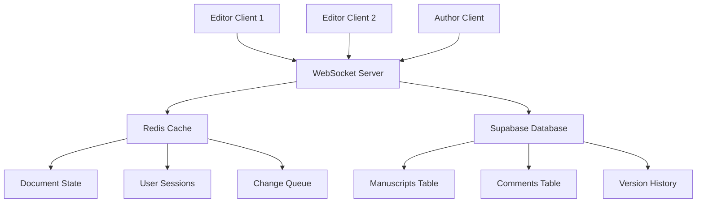
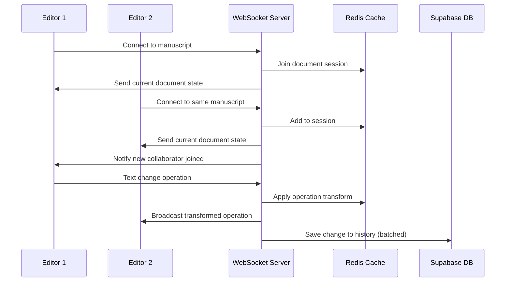

# ⚡ Real-time Collaborative Manuscript Editor Implementation Plan

## 📋 Overview

This document outlines the implementation of a **real-time collaborative manuscript editing system** for Myat Pwint Publishing House. This feature enables multiple editors, authors, and reviewers to work simultaneously on manuscripts with live updates, comments, and approval workflows.

## 🛠️ Tech Stack

- **Frontend**: React 19, TypeScript, Socket.io-client
- **Backend**: Node.js, Socket.io, Redis
- **Database**: Supabase (PostgreSQL)
- **Real-time**: WebSocket connections
- **Conflict Resolution**: Operational Transformation (OT)
- **Rich Text**: Quill.js or TipTap editor
- **Authentication**: Supabase Auth with role-based access

## 🏗️ System Architecture



## 🔄 Real-time Data Flow



---

## 🎯 Core Features Implementation

### **1. Document Synchronization Engine**

#### **WebSocket Server Setup**
```typescript
// server/websocket-server.ts
import { Server } from 'socket.io';
import { createClient } from 'redis';
import { createClient as createSupabaseClient } from '@supabase/supabase-js';

interface DocumentOperation {
  type: 'insert' | 'delete' | 'retain';
  text?: string;
  length?: number;
  position: number;
  userId: string;
  timestamp: number;
  operationId: string;
}

interface UserPresence {
  userId: string;
  name: string;
  avatar: string;
  cursor: {
    position: number;
    selection?: { start: number; end: number };
  };
  color: string;
  isActive: boolean;
  lastSeen: number;
}

class CollaborativeEditor {
  private io: Server;
  private redis;
  private supabase;
  private activeDocuments = new Map<string, Set<string>>();

  constructor() {
    this.io = new Server(3001, {
      cors: { origin: "http://localhost:3000" }
    });
    
    this.redis = createClient({
      url: process.env.REDIS_URL || 'redis://localhost:6379'
    });
    
    this.supabase = createSupabaseClient(
      process.env.NEXT_PUBLIC_SUPABASE_URL!,
      process.env.SUPABASE_SERVICE_ROLE_KEY!
    );

    this.setupEventHandlers();
  }

  private setupEventHandlers() {
    this.io.on('connection', (socket) => {
      console.log('User connected:', socket.id);

      // Join document session
      socket.on('join-document', async (data) => {
        await this.handleJoinDocument(socket, data);
      });

      // Handle text operations
      socket.on('text-operation', async (operation) => {
        await this.handleTextOperation(socket, operation);
      });

      // Handle cursor updates
      socket.on('cursor-update', async (cursorData) => {
        await this.handleCursorUpdate(socket, cursorData);
      });

      // Handle comments
      socket.on('add-comment', async (commentData) => {
        await this.handleAddComment(socket, commentData);
      });

      // Handle disconnection
      socket.on('disconnect', () => {
        this.handleDisconnect(socket);
      });
    });
  }

  private async handleJoinDocument(socket: any, data: {
    manuscriptId: string;
    userId: string;
    userInfo: { name: string; avatar: string; role: string };
  }) {
    const { manuscriptId, userId, userInfo } = data;
    
    // Verify user permissions
    const hasAccess = await this.verifyDocumentAccess(manuscriptId, userId);
    if (!hasAccess) {
      socket.emit('error', { message: 'Access denied' });
      return;
    }

    // Join document room
    socket.join(manuscriptId);
    socket.manuscriptId = manuscriptId;
    socket.userId = userId;

    // Add to active documents
    if (!this.activeDocuments.has(manuscriptId)) {
      this.activeDocuments.set(manuscriptId, new Set());
    }
    this.activeDocuments.get(manuscriptId)!.add(socket.id);

    // Get current document state
    const documentState = await this.getDocumentState(manuscriptId);
    
    // Send initial state to user
    socket.emit('document-state', documentState);

    // Broadcast user joined to others
    const userPresence: UserPresence = {
      userId,
      name: userInfo.name,
      avatar: userInfo.avatar,
      cursor: { position: 0 },
      color: this.generateUserColor(userId),
      isActive: true,
      lastSeen: Date.now()
    };

    // Store user presence in Redis
    await this.redis.setex(
      `presence:${manuscriptId}:${userId}`,
      300, // 5 minutes TTL
      JSON.stringify(userPresence)
    );

    // Notify others of new collaborator
    socket.to(manuscriptId).emit('user-joined', userPresence);

    // Send current active users to new user
    const activeUsers = await this.getActiveUsers(manuscriptId);
    socket.emit('active-users', activeUsers);
  }

  private async handleTextOperation(socket: any, operation: DocumentOperation) {
    const { manuscriptId, userId } = socket;
    
    try {
      // Transform operation against concurrent operations
      const transformedOperation = await this.transformOperation(
        manuscriptId, 
        operation
      );

      // Apply operation to document state
      await this.applyOperation(manuscriptId, transformedOperation);

      // Broadcast to other users
      socket.to(manuscriptId).emit('text-operation', transformedOperation);

      // Queue for database persistence (batched)
      await this.queueOperationForPersistence(manuscriptId, transformedOperation);

      // Update last activity
      await this.updateUserActivity(manuscriptId, userId);

    } catch (error) {
      console.error('Error handling text operation:', error);
      socket.emit('operation-error', { 
        operationId: operation.operationId,
        error: 'Failed to apply operation'
      });
    }
  }
}
```

#### **Operational Transformation System**
```typescript
// lib/operational-transform.ts
export class OperationalTransform {
  
  /**
   * Transform operation against another operation
   * Ensures consistency when operations are applied in different orders
   */
  static transform(op1: DocumentOperation, op2: DocumentOperation): DocumentOperation {
    // If operations don't overlap, no transformation needed
    if (op1.position + (op1.length || op1.text?.length || 0) <= op2.position) {
      return op1;
    }
    
    if (op2.position + (op2.length || op2.text?.length || 0) <= op1.position) {
      return {
        ...op1,
        position: op1.position + this.getOperationOffset(op2)
      };
    }

    // Handle overlapping operations
    return this.handleOverlappingOperations(op1, op2);
  }

  private static getOperationOffset(op: DocumentOperation): number {
    switch (op.type) {
      case 'insert':
        return op.text?.length || 0;
      case 'delete':
        return -(op.length || 0);
      case 'retain':
        return 0;
      default:
        return 0;
    }
  }

  private static handleOverlappingOperations(
    op1: DocumentOperation, 
    op2: DocumentOperation
  ): DocumentOperation {
    // Complex overlap resolution logic
    // This is simplified - real implementation would be more comprehensive
    
    if (op1.type === 'insert' && op2.type === 'insert') {
      // Both inserting at same position
      if (op1.position === op2.position) {
        // Use timestamp or user priority to determine order
        return op1.timestamp < op2.timestamp ? op1 : {
          ...op1,
          position: op1.position + (op2.text?.length || 0)
        };
      }
    }
    
    if (op1.type === 'delete' && op2.type === 'insert') {
      // Delete vs Insert conflict
      return {
        ...op1,
        position: op1.position + (op2.text?.length || 0)
      };
    }
    
    return op1; // Default case
  }
}
```

### **2. Real-time Comment System**

#### **Comment Component**
```typescript
// components/collaborative/CommentSystem.tsx
import React, { useState, useEffect } from 'react';
import { useSocket } from '@/hooks/useSocket';

interface Comment {
  id: string;
  text: string;
  author: {
    id: string;
    name: string;
    avatar: string;
  };
  position: {
    start: number;
    end: number;
  };
  resolved: boolean;
  created_at: string;
  replies: Comment[];
}

interface CommentSystemProps {
  manuscriptId: string;
  selectedText?: { start: number; end: number; text: string };
  onCommentSelect: (comment: Comment) => void;
}

export const CommentSystem: React.FC<CommentSystemProps> = ({
  manuscriptId,
  selectedText,
  onCommentSelect
}) => {
  const [comments, setComments] = useState<Comment[]>([]);
  const [newComment, setNewComment] = useState('');
  const [isAdding, setIsAdding] = useState(false);
  const socket = useSocket();

  useEffect(() => {
    if (!socket) return;

    // Listen for new comments
    socket.on('comment-added', (comment: Comment) => {
      setComments(prev => [...prev, comment]);
    });

    // Listen for comment updates
    socket.on('comment-updated', (updatedComment: Comment) => {
      setComments(prev => 
        prev.map(c => c.id === updatedComment.id ? updatedComment : c)
      );
    });

    // Load existing comments
    loadComments();

    return () => {
      socket.off('comment-added');
      socket.off('comment-updated');
    };
  }, [socket, manuscriptId]);

  const loadComments = async () => {
    try {
      const response = await fetch(`/api/manuscripts/${manuscriptId}/comments`);
      const commentsData = await response.json();
      setComments(commentsData);
    } catch (error) {
      console.error('Failed to load comments:', error);
    }
  };

  const addComment = async () => {
    if (!newComment.trim() || !selectedText) return;

    setIsAdding(true);
    try {
      const comment: Omit<Comment, 'id' | 'created_at'> = {
        text: newComment,
        author: {
          id: 'current-user-id', // Get from auth context
          name: 'Current User',   // Get from auth context
          avatar: '/default-avatar.png'
        },
        position: {
          start: selectedText.start,
          end: selectedText.end
        },
        resolved: false,
        replies: []
      };

      // Emit to socket for real-time update
      socket?.emit('add-comment', {
        manuscriptId,
        comment,
        selectedText: selectedText.text
      });

      setNewComment('');
    } catch (error) {
      console.error('Failed to add comment:', error);
    } finally {
      setIsAdding(false);
    }
  };

  const resolveComment = async (commentId: string) => {
    socket?.emit('resolve-comment', {
      manuscriptId,
      commentId
    });
  };

  return (
    <div className="comment-system">
      <div className="comments-panel">
        <h3>Comments</h3>
        
        {/* Add new comment */}
        {selectedText && (
          <div className="add-comment">
            <div className="selected-text">
              "{selectedText.text}"
            </div>
            <textarea
              value={newComment}
              onChange={(e) => setNewComment(e.target.value)}
              placeholder="Add a comment..."
              rows={3}
            />
            <button 
              onClick={addComment}
              disabled={isAdding || !newComment.trim()}
            >
              {isAdding ? 'Adding...' : 'Add Comment'}
            </button>
          </div>
        )}

        {/* Comments list */}
        <div className="comments-list">
          {comments.map(comment => (
            <CommentItem
              key={comment.id}
              comment={comment}
              onResolve={resolveComment}
              onSelect={() => onCommentSelect(comment)}
            />
          ))}
        </div>
      </div>
    </div>
  );
};

const CommentItem: React.FC<{
  comment: Comment;
  onResolve: (id: string) => void;
  onSelect: () => void;
}> = ({ comment, onResolve, onSelect }) => {
  return (
    <div 
      className={`comment-item ${comment.resolved ? 'resolved' : ''}`}
      onClick={onSelect}
    >
      <div className="comment-header">
        
        <span className="author">{comment.author.name}</span>
        <span className="timestamp">
          {new Date(comment.created_at).toLocaleDateString()}
        </span>
      </div>
      
      <div className="comment-text">{comment.text}</div>
      
      {!comment.resolved && (
        <button 
          className="resolve-btn"
          onClick={(e) => {
            e.stopPropagation();
            onResolve(comment.id);
          }}
        >
          Resolve
        </button>
      )}
    </div>
  );
};
```

### **3. User Presence & Cursors**

#### **Presence System**
```typescript
// components/collaborative/PresenceSystem.tsx
import React, { useEffect, useState } from 'react';
import { useSocket } from '@/hooks/useSocket';

interface UserCursor {
  userId: string;
  name: string;
  position: number;
  selection?: { start: number; end: number };
  color: string;
  isActive: boolean;
}

export const PresenceSystem: React.FC<{
  manuscriptId: string;
  editorRef: React.RefObject<any>;
}> = ({ manuscriptId, editorRef }) => {
  const [cursors, setCursors] = useState<UserCursor[]>([]);
  const [activeUsers, setActiveUsers] = useState<UserPresence[]>([]);
  const socket = useSocket();

  useEffect(() => {
    if (!socket) return;

    // Listen for cursor updates
    socket.on('cursor-update', (cursorData: UserCursor) => {
      setCursors(prev => {
        const filtered = prev.filter(c => c.userId !== cursorData.userId);
        return [...filtered, cursorData];
      });
    });

    // Listen for user presence changes
    socket.on('user-joined', (user: UserPresence) => {
      setActiveUsers(prev => [...prev, user]);
    });

    socket.on('user-left', (userId: string) => {
      setActiveUsers(prev => prev.filter(u => u.userId !== userId));
      setCursors(prev => prev.filter(c => c.userId !== userId));
    });

    // Send cursor updates when selection changes
    const handleSelectionChange = () => {
      if (!editorRef.current) return;
      
      const selection = editorRef.current.getSelection();
      const cursorPosition = selection?.index || 0;
      
      socket.emit('cursor-update', {
        manuscriptId,
        position: cursorPosition,
        selection: selection?.length ? {
          start: selection.index,
          end: selection.index + selection.length
        } : undefined
      });
    };

    // Attach to editor selection events
    if (editorRef.current) {
      editorRef.current.on('selection-change', handleSelectionChange);
    }

    return () => {
      socket.off('cursor-update');
      socket.off('user-joined');
      socket.off('user-left');
      
      if (editorRef.current) {
        editorRef.current.off('selection-change', handleSelectionChange);
      }
    };
  }, [socket, manuscriptId, editorRef]);

  // Render cursors overlay
  const renderCursors = () => {
    return cursors.map(cursor => (
      <CursorOverlay
        key={cursor.userId}
        cursor={cursor}
        editorRef={editorRef}
      />
    ));
  };

  return (
    <div className="presence-system">
      {/* Active users indicator */}
      <div className="active-users">
        {activeUsers.map(user => (
          <div key={user.userId} className="user-indicator">
            
            <span>{user.name}</span>
            <div 
              className="user-color"
              style={{ backgroundColor: user.color }}
            />
          </div>
        ))}
      </div>

      {/* Render cursors */}
      {renderCursors()}
    </div>
  );
};

const CursorOverlay: React.FC<{
  cursor: UserCursor;
  editorRef: React.RefObject<any>;
}> = ({ cursor, editorRef }) => {
  const [position, setPosition] = useState({ top: 0, left: 0 });

  useEffect(() => {
    if (!editorRef.current) return;

    // Get cursor position in editor
    const bounds = editorRef.current.getBounds(cursor.position);
    setPosition({
      top: bounds.top,
      left: bounds.left
    });
  }, [cursor.position, editorRef]);

  return (
    <div
      className="cursor-overlay"
      style={{
        position: 'absolute',
        top: position.top,
        left: position.left,
        borderLeft: `2px solid ${cursor.color}`,
        height: '20px',
        pointerEvents: 'none',
        zIndex: 1000
      }}
    >
      <div
        className="cursor-label"
        style={{
          backgroundColor: cursor.color,
          color: 'white',
          padding: '2px 6px',
          borderRadius: '3px',
          fontSize: '12px',
          marginTop: '-25px'
        }}
      >
        {cursor.name}
      </div>
    </div>
  );
};
```

### **4. Version Control System**

#### **Version History Component**
```typescript
// components/collaborative/VersionHistory.tsx
import React, { useState, useEffect } from 'react';

interface Version {
  id: string;
  version: number;
  title: string;
  content: string;
  author: {
    id: string;
    name: string;
  };
  changes_summary: string;
  created_at: string;
  is_major: boolean;
  word_count: number;
  character_count: number;
}

export const VersionHistory: React.FC<{
  manuscriptId: string;
  onRestoreVersion: (version: Version) => void;
}> = ({ manuscriptId, onRestoreVersion }) => {
  const [versions, setVersions] = useState<Version[]>([]);
  const [selectedVersions, setSelectedVersions] = useState<[string, string] | null>(null);
  const [isLoading, setIsLoading] = useState(false);

  useEffect(() => {
    loadVersionHistory();
  }, [manuscriptId]);

  const loadVersionHistory = async () => {
    setIsLoading(true);
    try {
      const response = await fetch(`/api/manuscripts/${manuscriptId}/versions`);
      const versionsData = await response.json();
      setVersions(versionsData);
    } catch (error) {
      console.error('Failed to load version history:', error);
    } finally {
      setIsLoading(false);
    }
  };

  const createVersion = async (title: string, isMajor: boolean) => {
    try {
      const response = await fetch(`/api/manuscripts/${manuscriptId}/versions`, {
        method: 'POST',
        headers: { 'Content-Type': 'application/json' },
        body: JSON.stringify({
          title,
          is_major: isMajor,
          changes_summary: 'Manual save point'
        })
      });
      
      if (response.ok) {
        loadVersionHistory(); // Refresh list
      }
    } catch (error) {
      console.error('Failed to create version:', error);
    }
  };

  const compareVersions = (v1: string, v2: string) => {
    setSelectedVersions([v1, v2]);
    // Open diff viewer component
  };

  return (
    <div className="version-history">
      <div className="version-header">
        <h3>Version History</h3>
        <button 
          onClick={() => createVersion('Manual Save', false)}
          className="save-version-btn"
        >
          Save Current Version
        </button>
      </div>

      {isLoading ? (
        <div className="loading">Loading versions...</div>
      ) : (
        <div className="versions-list">
          {versions.map((version, index) => (
            <VersionItem
              key={version.id}
              version={version}
              isLatest={index === 0}
              onRestore={() => onRestoreVersion(version)}
              onCompare={(otherId) => compareVersions(version.id, otherId)}
            />
          ))}
        </div>
      )}

      {selectedVersions && (
        <VersionDiff
          manuscriptId={manuscriptId}
          versionIds={selectedVersions}
          onClose={() => setSelectedVersions(null)}
        />
      )}
    </div>
  );
};

const VersionItem: React.FC<{
  version: Version;
  isLatest: boolean;
  onRestore: () => void;
  onCompare: (id: string) => void;
}> = ({ version, isLatest, onRestore, onCompare }) => {
  return (
    <div className={`version-item ${isLatest ? 'latest' : ''} ${version.is_major ? 'major' : ''}`}>
      <div className="version-info">
        <div className="version-header">
          <span className="version-number">v{version.version}</span>
          <span className="version-title">{version.title}</span>
          {version.is_major && <span className="major-badge">Major</span>}
        </div>
        
        <div className="version-meta">
          <span>By {version.author.name}</span>
          <span>{new Date(version.created_at).toLocaleString()}</span>
          <span>{version.word_count} words</span>
        </div>
        
        <div className="changes-summary">
          {version.changes_summary}
        </div>
      </div>

      <div className="version-actions">
        {!isLatest && (
          <button onClick={onRestore} className="restore-btn">
            Restore
          </button>
        )}
        <button onClick={() => onCompare(version.id)} className="compare-btn">
          Compare
        </button>
      </div>
    </div>
  );
};
```

### **5. Main Editor Integration**

#### **Collaborative Editor Component**
```typescript
// components/collaborative/CollaborativeEditor.tsx
import React, { useRef, useEffect, useState } from 'react';
import ReactQuill from 'react-quill';
import 'react-quill/dist/quill.snow.css';
import { useSocket } from '@/hooks/useSocket';
import { OperationalTransform } from '@/lib/operational-transform';
import { CommentSystem } from './CommentSystem';
import { PresenceSystem } from './PresenceSystem';
import { VersionHistory } from './VersionHistory';

interface CollaborativeEditorProps {
  manuscriptId: string;
  initialContent: string;
  isReadOnly?: boolean;
  userRole: 'author' | 'editor' | 'reviewer';
}

export const CollaborativeEditor: React.FC<CollaborativeEditorProps> = ({
  manuscriptId,
  initialContent,
  isReadOnly = false,
  userRole
}) => {
  const [content, setContent] = useState(initialContent);
  const [selectedText, setSelectedText] = useState<any>(null);
  const [isConnected, setIsConnected] = useState(false);
  const [collaborators, setCollaborators] = useState<any[]>([]);
  
  const quillRef = useRef<ReactQuill>(null);
  const socket = useSocket();
  const operationQueue = useRef<any[]>([]);
  const isApplyingOperation = useRef(false);

  useEffect(() => {
    if (!socket || !manuscriptId) return;

    // Join document session
    socket.emit('join-document', {
      manuscriptId,
      userId: 'current-user-id', // Get from auth
      userInfo: {
        name: 'Current User',
        avatar: '/avatar.png',
        role: userRole
      }
    });

    // Handle connection status
    socket.on('connect', () => setIsConnected(true));
    socket.on('disconnect', () => setIsConnected(false));

    // Handle document state
    socket.on('document-state', (state) => {
      setContent(state.content);
    });

    // Handle text operations from other users
    socket.on('text-operation', (operation) => {
      applyRemoteOperation(operation);
    });

    // Handle collaborator updates
    socket.on('active-users', setCollaborators);
    socket.on('user-joined', (user) => {
      setCollaborators(prev => [...prev, user]);
    });

    return () => {
      socket.off('connect');
      socket.off('disconnect');
      socket.off('document-state');
      socket.off('text-operation');
      socket.off('active-users');
      socket.off('user-joined');
    };
  }, [socket, manuscriptId]);

  const applyRemoteOperation = (operation: any) => {
    if (!quillRef.current || isApplyingOperation.current) return;

    isApplyingOperation.current = true;
    
    const quill = quillRef.current.getEditor();
    const currentLength = quill.getLength();

    try {
      switch (operation.type) {
        case 'insert':
          quill.insertText(operation.position, operation.text, 'api');
          break;
        case 'delete':
          quill.deleteText(operation.position, operation.length, 'api');
          break;
        case 'retain':
          // Handle formatting changes
          break;
      }
    } catch (error) {
      console.error('Failed to apply remote operation:', error);
    } finally {
      isApplyingOperation.current = false;
    }
  };

  const handleTextChange = (newContent: string, delta: any, source: string) => {
    if (source === 'api' || isApplyingOperation.current) return;

    setContent(newContent);

    // Convert delta to our operation format
    const operations = convertDeltaToOperations(delta);
    
    operations.forEach(operation => {
      socket?.emit('text-operation', {
        ...operation,
        userId: 'current-user-id',
        timestamp: Date.now(),
        operationId: generateOperationId()
      });
    });
  };

  const handleSelectionChange = (range: any) => {
    if (!range) return;

    if (range.length > 0) {
      const selectedContent = quillRef.current?.getEditor().getText(range.index, range.length);
      setSelectedText({
        start: range.index,
        end: range.index + range.length,
        text: selectedContent
      });
    } else {
      setSelectedText(null);
    }
  };

  const convertDeltaToOperations = (delta: any) => {
    const operations: any[] = [];
    let position = 0;

    delta.ops?.forEach((op: any) => {
      if (op.retain) {
        position += op.retain;
      } else if (op.insert) {
        operations.push({
          type: 'insert',
          text: op.insert,
          position,
          attributes: op.attributes
        });
        position += op.insert.length;
      } else if (op.delete) {
        operations.push({
          type: 'delete',
          length: op.delete,
          position
        });
      }
    });

    return operations;
  };

  const generateOperationId = () => {
    return `${Date.now()}-${Math.random().toString(36).substr(2, 9)}`;
  };

  const modules = {
    toolbar: isReadOnly ? false : [
      [{ 'header': [1, 2, 3, 4, 5, 6, false] }],
      ['bold', 'italic', 'underline', 'strike'],
      [{ 'color': [] }, { 'background': [] }],
      [{ 'list': 'ordered'}, { 'list': 'bullet' }],
      [{ 'indent': '-1'}, { 'indent': '+1' }],
      ['link', 'blockquote', 'code-block'],
      ['clean']
    ],
    history: {
      delay: 2000,
      maxStack: 500,
      userOnly: true
    }
  };

  return (
    <div className="collaborative-editor">
      {/* Connection status */}
      <div className={`connection-status ${isConnected ? 'connected' : 'disconnected'}`}>
        {isConnected ? '🟢 Connected' : '🔴 Disconnected'}
        {collaborators.length > 0 && (
          <span className="collaborator-count">
            {collaborators.length} collaborator{collaborators.length > 1 ? 's' : ''}
          </span>
        )}
      </div>

      <div className="editor-layout">
        {/* Main editor */}
        <div className="editor-main">
          <PresenceSystem 
            manuscriptId={manuscriptId} 
            editorRef={quillRef} 
          />
          
          <ReactQuill
            ref={quillRef}
            value={content}
            onChange={handleTextChange}
            onSelectionChange={handleSelectionChange}
            modules={modules}
            readOnly={isReadOnly}
            placeholder="Start writing your manuscript..."
            style={{ height: '600px' }}
          />
        </div>

        {/* Side panels */}
        <div className="editor-sidebar">
          <CommentSystem
            manuscriptId={manuscriptId}
            selectedText={selectedText}
            onCommentSelect={(comment) => {
              // Highlight comment in editor
              const quill = quillRef.current?.getEditor();
              quill?.setSelection(comment.position.start, comment.position.end - comment.position.start);
            }}
          />
          
          <VersionHistory
            manuscriptId={manuscriptId}
            onRestoreVersion={(version) => {
              setContent(version.content);
              // Emit restore operation to other users
              socket?.emit('version-restored', {
                manuscriptId,
                versionId: version.id,
                content: version.content
              });
            }}
          />
        </div>
      </div>
    </div>
  );
};
```

---

## 🚀 Setup & Installation

### **1. WebSocket Server Setup**
```bash
# Install dependencies
npm install socket.io socket.io-client redis @types/redis

# Create WebSocket server
mkdir server
cd server
npm init -y
npm install socket.io redis @supabase/supabase-js
```

### **2. Redis Configuration**
```bash
# Install Redis (macOS)
brew install redis
brew services start redis

# Or use Docker
docker run -d -p 6379:6379 redis:alpine
```

### **3. Database Schema**
```sql
-- Version history table
CREATE TABLE manuscript_versions (
  id UUID DEFAULT gen_random_uuid() PRIMARY KEY,
  manuscript_id UUID REFERENCES manuscripts(id) ON DELETE CASCADE,
  version INTEGER NOT NULL,
  title TEXT NOT NULL,
  content TEXT NOT NULL,
  author_id UUID REFERENCES auth.users(id),
  changes_summary TEXT,
  word_count INTEGER DEFAULT 0,
  character_count INTEGER DEFAULT 0,
  is_major BOOLEAN DEFAULT FALSE,
  created_at TIMESTAMPTZ DEFAULT NOW()
);

-- Comments table
CREATE TABLE manuscript_comments (
  id UUID DEFAULT gen_random_uuid() PRIMARY KEY,
  manuscript_id UUID REFERENCES manuscripts(id) ON DELETE CASCADE,
  user_id UUID REFERENCES auth.users(id),
  content TEXT NOT NULL,
  position_start INTEGER NOT NULL,
  position_end INTEGER NOT NULL,
  selected_text TEXT,
  resolved BOOLEAN DEFAULT FALSE,
  parent_comment_id UUID REFERENCES manuscript_comments(id),
  created_at TIMESTAMPTZ DEFAULT NOW(),
  updated_at TIMESTAMPTZ DEFAULT NOW()
);

-- Operations log for conflict resolution
CREATE TABLE manuscript_operations (
  id UUID DEFAULT gen_random_uuid() PRIMARY KEY,
  manuscript_id UUID REFERENCES manuscripts(id) ON DELETE CASCADE,
  user_id UUID REFERENCES auth.users(id),
  operation_id TEXT UNIQUE NOT NULL,
  operation_type TEXT NOT NULL, -- 'insert', 'delete', 'retain'
  position INTEGER NOT NULL,
  content TEXT,
  length INTEGER,
  attributes JSONB,
  timestamp BIGINT NOT NULL,
  applied BOOLEAN DEFAULT TRUE,
  created_at TIMESTAMPTZ DEFAULT NOW()
);

-- Indexes for performance
CREATE INDEX idx_manuscript_versions_manuscript_id ON manuscript_versions(manuscript_id);
CREATE INDEX idx_manuscript_comments_manuscript_id ON manuscript_comments(manuscript_id);
CREATE INDEX idx_manuscript_operations_manuscript_id ON manuscript_operations(manuscript_id);
CREATE INDEX idx_manuscript_operations_timestamp ON manuscript_operations(timestamp);
```

### **4. API Routes**
```typescript
// pages/api/manuscripts/[id]/versions.ts
export async function GET(req: Request, { params }: { params: { id: string } }) {
  const { data: versions } = await supabase
    .from('manuscript_versions')
    .select(`
      *,
      author:auth.users(id, name)
    `)
    .eq('manuscript_id', params.id)
    .order('created_at', { ascending: false });

  return Response.json(versions);
}

export async function POST(req: Request, { params }: { params: { id: string } }) {
  const { title, is_major, changes_summary } = await req.json();
  
  // Get current manuscript content
  const { data: manuscript } = await supabase
    .from('manuscripts')
    .select('content')
    .eq('id', params.id)
    .single();

  // Get next version number
  const { data: lastVersion } = await supabase
    .from('manuscript_versions')
    .select('version')
    .eq('manuscript_id', params.id)
    .order('version', { ascending: false })
    .limit(1)
    .single();

  const nextVersion = (lastVersion?.version || 0) + 1;

  // Create new version
  const { data: newVersion } = await supabase
    .from('manuscript_versions')
    .insert({
      manuscript_id: params.id,
      version: nextVersion,
      title,
      content: manuscript.content,
      changes_summary,
      is_major,
      word_count: manuscript.content.split(/\s+/).length,
      character_count: manuscript.content.length
    })
    .select()
    .single();

  return Response.json(newVersion);
}
```

---

## 📊 Performance Considerations

### **Optimization Strategies**
1. **Operation Batching**: Group multiple operations before sending
2. **Delta Compression**: Only send changes, not full content
3. **Connection Throttling**: Limit concurrent connections per document
4. **Redis Clustering**: Scale WebSocket server horizontally
5. **Content Caching**: Cache document states in Redis

### **Conflict Resolution**
1. **Last Writer Wins**: Simple but can lose data
2. **Operational Transform**: Complex but preserves all changes
3. **Three-way Merge**: Git-style conflict resolution
4. **Manual Resolution**: Let users choose in conflicts

---

## 🎯 Expected Results

### **Real-time Collaboration Features**
- **Simultaneous editing** by multiple users
- **Live cursor tracking** and user presence
- **Instant comment updates** and discussions
- **Automatic conflict resolution** using OT
- **Version control** with branching and merging

### **User Experience Benefits**
- **Seamless collaboration** for editorial workflows
- **Reduced editing cycles** through real-time feedback
- **Better manuscript quality** through collaborative review
- **Efficient approval process** with in-line comments

This implementation provides a **professional-grade collaborative editing system** comparable to Google Docs or Notion, specifically tailored for manuscript editing workflows in the Myanmar publishing industry.