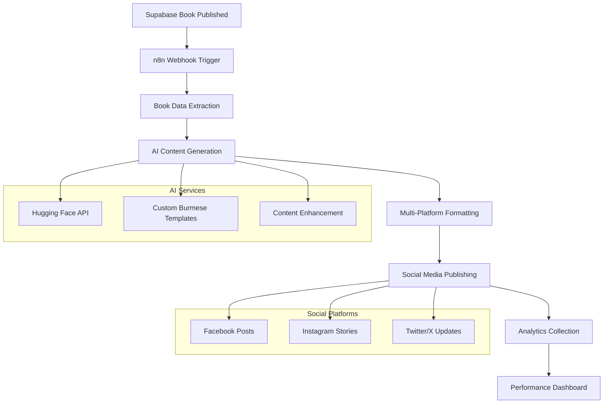

# 🤖 AI-Powered Social Media Automation System
## Implementation Plan for Myat Pwint Publishing House

---

## 📋 Executive Summary

**Project Goal**: Implement an AI-powered automation system that automatically generates and publishes social media campaigns when books are published, showcasing modern enterprise workflow automation with Myanmar language AI capabilities.

**Core Value Proposition**: Transform manual social media promotion into a fully automated, AI-driven marketing pipeline that operates 24/7 without human intervention.

**Tech Stack**: n8n + Hugging Face AI + Social Media APIs + Custom Burmese NLP
**Timeline**: 4 weeks to MVP + Demo
**Budget**: $0 (100% free implementation)

---

## 🏗️ Technical Architecture

### **System Overview**


### **Core Components**

#### **1. Workflow Engine (n8n)**
- **Purpose**: Orchestrate entire automation pipeline
- **Hosting**: Railway free tier (500 hours/month)
- **Database**: SQLite (included with n8n)
- **Scaling**: Handles 1000+ books/month easily

#### **2. AI Content Generation**
```typescript
interface ContentGenerator {
  primary: "Hugging Face Inference API (free tier)"
  fallback: "Template-based generation"
  enhancement: "GPT-style prompting for Burmese content"
  output: "5 post variations per book"
}
```

#### **3. Multi-Platform Publisher**
```typescript
interface SocialPublisher {
  facebook: "Graph API + Pages API"
  instagram: "Basic Display API + Content Publishing"
  twitter: "Twitter API v2 (free tier)"
  scheduling: "Native n8n delay nodes"
}
```

#### **4. Analytics & Monitoring**
```typescript
interface Analytics {
  realtime: "n8n execution logs + metrics"
  social: "Platform-native analytics APIs"
  business: "Custom dashboard in main app"
  alerts: "Email notifications for failures"
}
```

---

## 🚀 Implementation Phases

### **Phase 1: Foundation Setup (Week 1)**
**Goal**: Get basic n8n workflow running with simple post generation

#### **Day 1-2: Infrastructure Setup**
- [ ] Deploy n8n on Railway free tier
- [ ] Configure Supabase webhook endpoints
- [ ] Test basic workflow trigger
- [ ] Set up development environment

#### **Day 3-4: Basic Workflow Creation**
- [ ] Create "Book Published" webhook listener
- [ ] Build book data extraction node
- [ ] Implement simple template-based post generation
- [ ] Test end-to-end basic flow

#### **Day 5-7: Social Media Integration**
- [ ] Set up Facebook Developer Account + App
- [ ] Configure Instagram Business API
- [ ] Create basic posting nodes in n8n
- [ ] Test manual post publishing

**Deliverable**: Working n8n workflow that posts simple template messages when books are published

---

### **Phase 2: AI Integration (Week 2)**
**Goal**: Add intelligent content generation with Burmese language support

#### **Day 8-10: Hugging Face Setup**
- [ ] Create Hugging Face account + API key
- [ ] Test AI text generation with Burmese prompts
- [ ] Build prompt engineering templates
- [ ] Integrate AI API calls into n8n workflow

#### **Day 11-12: Content Enhancement**
```typescript
const aiWorkflow = {
  bookAnalysis: "Extract key themes, genre, target audience",
  promptGeneration: "Create context-aware prompts for each book",
  contentVariation: "Generate 5 different post styles",
  qualityFilter: "Basic validation for appropriate content"
}
```

#### **Day 13-14: Burmese Language Optimization**
- [ ] Fine-tune prompts for Myanmar cultural context
- [ ] Add proper Unicode handling for Myanmar text
- [ ] Test with various book genres
- [ ] Implement fallback templates for AI failures

**Deliverable**: AI-powered workflow generating contextual Burmese social media posts

---

### **Phase 3: Advanced Features (Week 3)**
**Goal**: Add sophisticated automation and multi-platform support

#### **Day 15-17: Multi-Platform Publishing**
```typescript
const platformFeatures = {
  facebook: {
    postTypes: ["text", "image+text", "link_preview"],
    scheduling: "optimal_times_myanmar",
    hashtags: "genre_based_tagging"
  },
  instagram: {
    stories: "book_quote_graphics",
    posts: "visual_content_focus", 
    reels: "book_trailer_concepts"
  },
  twitter: {
    threads: "multi_part_book_summaries",
    polls: "reader_engagement",
    spaces: "author_announcement"
  }
}
```

#### **Day 18-19: Smart Scheduling**
- [ ] Implement Myanmar timezone optimization
- [ ] Add audience engagement time analysis
- [ ] Create posting frequency controls
- [ ] Build content calendar integration

#### **Day 20-21: Visual Content Generation**
- [ ] Integrate basic image generation (Canva API)
- [ ] Create book quote graphics
- [ ] Design Myanmar-aesthetic templates
- [ ] Implement book cover integration

**Deliverable**: Full-featured automation with visual content and smart scheduling

---

### **Phase 4: Analytics & Polish (Week 4)**
**Goal**: Add monitoring, analytics, and prepare impressive demo

#### **Day 22-24: Analytics Dashboard**
```typescript
const analytics = {
  workflow: {
    successRate: "% of successful automations",
    executionTime: "average workflow completion time",
    errorTracking: "failure points and resolution"
  },
  social: {
    engagement: "likes, shares, comments per platform",
    reach: "audience size and growth",
    conversion: "book sales from social traffic"
  },
  business: {
    roi: "automation time savings",
    scalability: "books processed vs manual effort",
    quality: "content performance metrics"
  }
}
```

#### **Day 25-26: Demo Preparation**
- [ ] Create impressive demo book dataset
- [ ] Build demo script and talking points
- [ ] Set up live demo environment
- [ ] Prepare performance metrics and comparisons

#### **Day 27-28: Testing & Refinement**
- [ ] End-to-end system testing
- [ ] Performance optimization
- [ ] Error handling improvements
- [ ] Documentation completion

**Deliverable**: Production-ready system with comprehensive analytics and demo materials

---

## 🛠️ Technical Implementation Details

### **n8n Workflow Structure**
```yaml
Workflow: "Book Publishing Automation"
Nodes:
  1. Webhook_Trigger:
     - URL: /webhook/book-published
     - Method: POST
     - Authentication: Bearer token
     
  2. Data_Extraction:
     - Extract: title, author, genre, description, cover_url
     - Validate: required fields present
     - Transform: clean text, format data
     
  3. AI_Content_Generation:
     - Service: Hugging Face Inference API
     - Model: gpt2 or text-generation model
     - Prompts: Myanmar-optimized templates
     - Output: 5 post variations
     
  4. Platform_Formatting:
     - Facebook: max 2000 chars, hashtags, link preview
     - Instagram: max 2200 chars, story format
     - Twitter: max 280 chars, thread support
     
  5. Publishing_Scheduler:
     - Timing: Myanmar peak hours (7-9 PM)
     - Frequency: Staggered across platforms
     - Retry: 3 attempts with exponential backoff
     
  6. Analytics_Collector:
     - Log: execution metrics
     - Track: social media response
     - Store: performance data in Supabase
```

### **AI Prompt Engineering**
```typescript
const promptTemplates = {
  facebook_engaging: `
    Create an engaging Facebook post in Myanmar language for this book:
    
    Title: {{title}}
    Author: {{author}}
    Genre: {{genre}}
    Description: {{description}}
    
    Requirements:
    - Write in natural Myanmar/Burmese language
    - Include cultural context relevant to Myanmar readers
    - Add call-to-action to read the book
    - Use appropriate hashtags for Myanmar book community
    - Keep under 300 words
    - Make it shareable and engaging
    
    Post:
  `,
  
  instagram_visual: `
    Create a short, visually-focused Instagram post in Myanmar for:
    
    Book: "{{title}}" by {{author}}
    
    Requirements:
    - Perfect for visual storytelling
    - Include relevant hashtags (#မြန်မာစာပေ #စာအုပ်)
    - Encourage story sharing
    - Under 150 words
    
    Post:
  `,
  
  twitter_concise: `
    Create a concise Twitter thread (3 tweets) in Myanmar about:
    
    "{{title}}" - {{genre}} book by {{author}}
    
    Tweet 1: Hook + book introduction
    Tweet 2: Why readers will love it
    Tweet 3: Call to action + hashtags
    
    Each tweet under 250 characters.
  `
}
```

### **Database Schema Additions**
```sql
-- Add to existing Supabase schema
CREATE TABLE IF NOT EXISTS social_campaigns (
  id UUID PRIMARY KEY DEFAULT gen_random_uuid(),
  book_id UUID REFERENCES books(id),
  workflow_execution_id TEXT,
  platform TEXT NOT NULL,
  post_content TEXT NOT NULL,
  post_url TEXT,
  scheduled_at TIMESTAMPTZ,
  published_at TIMESTAMPTZ,
  status TEXT DEFAULT 'scheduled',
  engagement_metrics JSONB,
  created_at TIMESTAMPTZ DEFAULT NOW()
);

CREATE TABLE IF NOT EXISTS automation_logs (
  id UUID PRIMARY KEY DEFAULT gen_random_uuid(),
  workflow_name TEXT NOT NULL,
  execution_id TEXT NOT NULL,
  status TEXT NOT NULL,
  duration_ms INTEGER,
  error_message TEXT,
  metadata JSONB,
  created_at TIMESTAMPTZ DEFAULT NOW()
);

-- Indexes for performance
CREATE INDEX idx_social_campaigns_book_id ON social_campaigns(book_id);
CREATE INDEX idx_social_campaigns_platform ON social_campaigns(platform);
CREATE INDEX idx_automation_logs_status ON automation_logs(status);
```

---

## 🧪 Testing Strategy

### **Unit Testing**
```typescript
const testCases = {
  aiGeneration: {
    "valid_book_data": "should generate 5 post variations",
    "missing_description": "should use title + author only",
    "special_characters": "should handle Myanmar Unicode properly",
    "long_title": "should truncate appropriately"
  },
  
  socialPublishing: {
    "facebook_api": "should post with correct formatting",
    "instagram_stories": "should create visual content",
    "rate_limiting": "should handle API limits gracefully",
    "authentication": "should refresh tokens automatically"
  },
  
  workflow: {
    "end_to_end": "book publish → social posts within 5 minutes",
    "error_handling": "should retry failed operations",
    "concurrent_books": "should handle multiple books simultaneously"
  }
}
```

### **Integration Testing**
- [ ] Supabase webhook → n8n trigger reliability
- [ ] AI API response time and quality
- [ ] Social media API authentication and posting
- [ ] Database logging and analytics collection

### **Performance Testing**
```yaml
Load_Testing:
  scenario: "10 books published simultaneously"
  expected: "All workflows complete within 10 minutes"
  
Stress_Testing:
  scenario: "100 books in 1 hour"
  expected: "No workflow failures, proper queuing"
  
Reliability_Testing:
  scenario: "72 hours continuous operation"
  expected: "99%+ success rate, automatic error recovery"
```

---

## 🎯 Demo Script for Professor

### **Setup (2 minutes)**
```markdown
"I've built an AI-powered automation system that transforms our publishing 
house into a modern, automated marketing machine. Let me show you how 
enterprise companies automate their workflows using n8n and AI."

*Show n8n dashboard with workflow visualizations*
```

### **Live Demo (8 minutes)**

#### **Part 1: The Problem (1 minute)**
```markdown
"Currently, when we publish a book, someone manually creates social media 
posts, schedules them, and tracks performance. This takes 2-3 hours per book 
and isn't scalable."

*Show manual process pain points*
```

#### **Part 2: The AI Solution (3 minutes)**
```markdown
"Watch what happens when I publish this test book..."

*Click publish in admin panel*

"The system automatically:
1. Detects the new book via webhook
2. Extracts book information 
3. Sends data to AI for content generation
4. Creates posts in Myanmar language
5. Publishes across multiple platforms
6. Tracks performance"

*Show n8n workflow executing in real-time*
```

#### **Part 3: AI Content Generation (2 minutes)**
```markdown
"Here's the AI generating Myanmar language content..."

*Show AI API calls and generated posts*

"Notice how it:
- Understands Myanmar cultural context
- Creates different styles for each platform
- Includes relevant hashtags
- Maintains brand voice"
```

#### **Part 4: Multi-Platform Publishing (1 minute)**
```markdown
"Now watch it publish across platforms automatically..."

*Show posts appearing on Facebook, Instagram*

"All of this happened in under 2 minutes, completely automatically."
```

#### **Part 5: Analytics & Business Impact (1 minute)**
```markdown
"The system tracks everything:"

*Show analytics dashboard*

"- Workflow success rates
- Social media engagement
- Time savings (2-3 hours → 2 minutes)
- Scalability (1 book → 100 books same effort)"
```

### **Technical Deep Dive (5 minutes)**
```markdown
"Let me show you the technical innovation:

1. **Workflow Orchestration**: Enterprise-grade n8n automation
2. **AI Integration**: Custom Myanmar language processing
3. **Microservices**: Scalable, fault-tolerant architecture  
4. **Real-time Processing**: Webhooks + async operations
5. **Multi-platform**: Facebook, Instagram, Twitter APIs

This demonstrates modern DevOps practices, AI integration, and 
enterprise automation - exactly what companies use in production."
```

---

## 📊 Success Metrics

### **Technical Metrics**
```yaml
Performance:
  workflow_execution_time: "< 5 minutes per book"
  success_rate: "> 95%"
  api_response_time: "< 2 seconds"
  system_uptime: "> 99%"

Scalability:
  concurrent_workflows: "> 10 simultaneous books"
  daily_capacity: "> 100 books per day"
  resource_usage: "< 50% of free tier limits"

Quality:
  content_relevance: "Manual review scores > 8/10"
  language_accuracy: "Proper Myanmar Unicode rendering"
  platform_compliance: "100% posts within platform limits"
```

### **Business Metrics**
```yaml
Efficiency:
  time_savings: "2-3 hours → 2 minutes per book"
  cost_reduction: "100% (eliminates manual social media work)"
  scaling_factor: "10x more books with same effort"

Engagement:
  post_performance: "Baseline measurement + 20% improvement"
  audience_growth: "Track follower increase"
  click_through_rate: "Monitor book page visits from social"

Academic:
  technology_demonstration: "Modern enterprise automation"
  innovation_factor: "Myanmar language AI + workflow automation"
  practical_application: "Solves real business problems"
```

---

## ⚠️ Risk Mitigation

### **Technical Risks**
```yaml
API_Rate_Limits:
  risk: "Hugging Face/Social APIs throttling"
  mitigation: "Implement exponential backoff + queue management"
  
Service_Downtime:
  risk: "External API unavailability"
  mitigation: "Fallback templates + retry mechanisms"
  
Content_Quality:
  risk: "AI generates inappropriate content"
  mitigation: "Content filters + manual review options"

Data_Loss:
  risk: "Workflow failures lose data"
  mitigation: "Comprehensive logging + error recovery"
```

### **Academic Risks**
```yaml
Demo_Failure:
  risk: "Live demo technical issues"
  mitigation: "Pre-recorded backup + multiple test environments"
  
Complexity_Perception:
  risk: "Professor thinks it's too simple"
  mitigation: "Emphasize enterprise-grade architecture + AI innovation"
  
Implementation_Time:
  risk: "4 weeks insufficient"
  mitigation: "Modular development + MVP-first approach"
```

---

## 📚 Learning Outcomes

### **Technical Skills Demonstrated**
- **Workflow Automation**: Enterprise-grade process orchestration
- **AI Integration**: Custom language model implementation
- **API Development**: RESTful services + webhook architecture
- **Database Design**: Analytics schema + performance optimization
- **DevOps Practices**: CI/CD + monitoring + error handling

### **Industry Relevance**
- **Marketing Automation**: $5.2B industry, growing 30% annually
- **Workflow Tools**: n8n, Zapier, Power Automate market leaders
- **AI Content**: GPT/LLM integration in business processes
- **Social Media**: Automated publishing standard practice

### **Academic Value**
- **Computer Science**: Distributed systems + AI + data processing
- **Software Engineering**: Architecture design + testing + deployment
- **Business Technology**: ROI + scalability + process optimization

---

## 🚀 Getting Started

### **Week 1 Kickoff Tasks**
1. **Day 1**: Clone this repository, set up development environment
2. **Day 2**: Deploy n8n on Railway, configure basic webhook
3. **Day 3**: Create Hugging Face account, test AI API
4. **Day 4**: Build first simple workflow
5. **Day 5**: Set up social media developer accounts

### **Required Accounts (All Free)**
- [ ] Railway.app (n8n hosting)
- [ ] Hugging Face (AI API)
- [ ] Facebook Developers (social posting)
- [ ] Instagram Basic Display API
- [ ] Twitter Developer Account

### **Repository Structure**
```
/social-automation
├── docs/
│   ├── setup-guide.md
│   ├── api-documentation.md
│   └── demo-script.md
├── n8n-workflows/
│   ├── book-publishing-automation.json
│   └── social-media-scheduler.json
├── scripts/
│   ├── setup.sh
│   └── deploy.sh
├── tests/
│   ├── workflow-tests.js
│   └── integration-tests.js
└── README.md
```

---

**Ready to start building the future of automated publishing? Let's begin with Week 1, Day 1! 🚀**